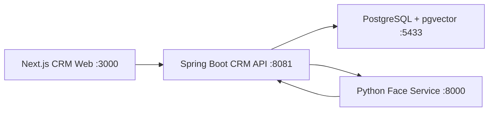
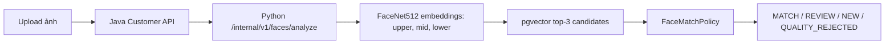

# Tài liệu chức năng và nguồn dữ liệu — Retail Emotion CRM

> Phiên bản tài liệu: 27/07/2026  
> Phạm vi: frontend Next.js, CRM API Java/Spring Boot, dịch vụ nhận diện khuôn mặt Python và PostgreSQL/pgvector.  
> Lưu ý: số lượng bản ghi trong tài liệu là ảnh chụp dữ liệu tại thời điểm kiểm tra, có thể thay đổi sau khi chạy thêm demo hoặc thao tác trên giao diện.

## 1. Tổng quan hệ thống

Hệ thống gồm bốn service chính:

| Service | Công nghệ | Cổng máy host | Vai trò |
|---|---|---:|---|
| `postgres-vector` | PostgreSQL + pgvector | `5433` | Lưu tài khoản, khách hàng, vector khuôn mặt, đơn hàng và dữ liệu trải nghiệm |
| `face-service` | Python | `8000` | Phân tích ảnh, kiểm tra chất lượng và sinh embedding FaceNet512 |
| `crm-api` | Java/Spring Boot | `8081` | Xác thực, nghiệp vụ CRM, dashboard, tìm khuôn mặt và truy vấn database |
| `crm-web` | Next.js | `3000` | Giao diện Retail Emotion CRM |

Luồng xử lý tổng quát:



Khởi động toàn bộ hệ thống:

```bash
docker compose up -d --build
```

Các địa chỉ dùng để kiểm tra:

- Giao diện CRM: <http://localhost:3000>
- Swagger của face service: <http://localhost:8000/docs>
- CRM API: <http://localhost:8081>

API Java yêu cầu JWT ở hầu hết endpoint nên truy cập trực tiếp `/` trả về `403` là hành vi bình thường, không có nghĩa service bị lỗi.

## 2. Tài khoản đăng nhập

Các tài khoản demo hiện có:

| Username | Password | Vai trò | Tên hiển thị |
|---|---|---|---|
| `admin` | `admin` | `ADMIN` | Dino Nguyen |
| `manager` | `demo123` | `MANAGER` | CRM Manager |
| `agent` | `admin` | `AGENT` | Agent |

Ba tài khoản đều đang mở khóa và đã được kiểm tra đăng nhập thành công qua API.

### Cách đăng nhập

Frontend gọi:

```http
POST /api/v1/auth/login
```

Sau khi đăng nhập thành công, frontend lưu hai giá trị trong `localStorage`:

- `crm_token`: JWT dùng để gọi API.
- `crm_user`: thông tin người dùng hiện tại.

### Cách đăng xuất

Nút đăng xuất chỉ xóa `crm_token` và `crm_user` khỏi `localStorage`, sau đó đưa người dùng về màn hình đăng nhập.

Hiện backend chưa có endpoint thu hồi token hoặc blacklist token. JWT cũ vẫn hợp lệ cho tới khi hết hạn, hiện là khoảng 24 giờ, nếu token đó bị sao chép và sử dụng bên ngoài trình duyệt.

## 3. Kết nối database

Thông tin kết nối PostgreSQL từ máy host:

| Trường | Giá trị |
|---|---|
| Host | `localhost` |
| Port | `5433` |
| User | `postgres` |
| Password | `postgres` |
| Database | `postgres` |
| JDBC URL | `jdbc:postgresql://localhost:5433/postgres` |

Trong IntelliJ/DataGrip, chọn PostgreSQL rồi điền các giá trị trên và bấm **Test Connection**.

Một số câu lệnh kiểm tra nhanh:

```sql
SELECT username, role, fullname, locked
FROM or_user
ORDER BY id;

SELECT *
FROM customers
ORDER BY id;

SELECT *
FROM experience_sessions
ORDER BY started_at DESC;

SELECT *
FROM experience_state_events
ORDER BY observed_at DESC;

SELECT *
FROM so_sales_order
ORDER BY id DESC;
```

## 4. Phân quyền giao diện

| Chức năng | AGENT | MANAGER | ADMIN |
|---|:---:|:---:|:---:|
| Dashboard | Có | Có | Có |
| Customer List | Có | Có | Có |
| Sale Performance | Không hiển thị | Có | Có |
| Face Search & 360 | Không hiển thị | Có | Có |
| Nhật ký & Đối soát | Không hiển thị | Có | Có |

Phân quyền hiện chưa đồng nhất giữa menu, router frontend và backend:

- Sidebar ẩn các mục quản lý đối với `AGENT`.
- Frontend vẫn tin giá trị `?tab=...`, chưa chặn vai trò ở cấp trang.
- API Sale Performance và Customer 360 có kiểm tra vai trò.
- Các API Experience Logs hiện chỉ yêu cầu đăng nhập, vì vậy `AGENT` vẫn có thể gọi trực tiếp.
- API cập nhật sản phẩm cũng chỉ yêu cầu đăng nhập, chưa giới hạn `MANAGER/ADMIN`.

## 5. Dashboard

### 5.1. Nguồn dữ liệu

Dashboard gọi:

```http
GET /api/v1/dashboard/stats?date=YYYY-MM-DD
```

Luồng dữ liệu:

```text
DashboardView
  -> useCrmViewModel
  -> DashboardController
  -> JDBC query
  -> experience_sessions + experience_state_events
```

Hai bảng chính:

- `experience_sessions`: phiên trải nghiệm của khách tại cửa hàng.
- `experience_state_events`: các trạng thái cảm xúc phát hiện trong từng phiên.

Dịch vụ Python không trực tiếp cung cấp các KPI đang hiển thị trên Dashboard. Dữ liệu hiện tại chủ yếu là dữ liệu demo do `DemoDataInitializer` tạo.

Ngày mặc định của giao diện đang được hardcode là `23/07/2026`.

### 5.2. Bộ lọc ngày

- **Ngày phân tích**: truyền ngày được chọn vào query parameter `date`.
- **Hôm nay**: đưa bộ lọc về ngày hiện tại.
- **Tất cả lịch sử**: gọi API không giới hạn ngày.

Vấn đề hiện tại: khi ngày được chọn không có dữ liệu, backend không trả tập rỗng mà trả một bộ số giả fallback. Vì vậy người dùng có thể thấy KPI dù database không có event trong ngày đó.

### 5.3. Năm KPI đầu trang

| KPI | Cách tính hiện tại | Dữ liệu ngày 23/07/2026 |
|---|---|---:|
| Tổng lượng khách | Số `customer_id` khác nhau trong `experience_sessions` | `2` |
| Chỉ số phân vân — CBI | `CONFUSED events / tổng events × 100` | `16.7%` |
| Chỉ số sốt ruột — IBI | `IMPATIENT events / tổng events × 100` | `8.3%` |
| Chỉ số không hài lòng — DRI | `DISSATISFIED events / tổng events × 100` | `0.0%` |
| Tỷ lệ chuyển đổi hài lòng — EDC | `DELIGHTED / (ENGAGED + DELIGHTED) × 100` | `50.0%` |

EDC đang được ghi là “Engage → Delighted”, nhưng backend không theo dõi chuyển trạng thái của cùng một khách. Công thức hiện tại chỉ lấy tỷ lệ giữa tổng số event `DELIGHTED` và tổng `ENGAGED + DELIGHTED`.

Nhãn trạng thái như **Tốt**, **Cảnh báo**, **Rất tốt** đang được hardcode trên frontend, chưa được tính từ mục tiêu. Ví dụ CBI là `16.7%`, cao hơn mục tiêu `<= 8%`, nhưng giao diện vẫn có thể hiện nhãn **Tốt**.

### 5.4. Phân bố cảm xúc

Sáu nhóm trạng thái:

| Trạng thái | Ý nghĩa | Số event | Tỷ lệ |
|---|---|---:|---:|
| `DELIGHTED` | Rất hài lòng | 3 | 25% |
| `ENGAGED` | Hứng thú | 3 | 25% |
| `NEUTRAL` | Trung tính | 3 | 25% |
| `CONFUSED` | Phân vân | 2 | 17% |
| `IMPATIENT` | Sốt ruột | 1 | 8% |
| `DISSATISFIED` | Tệ/không hài lòng | 0 | 0% |
| **Tổng** |  | **12** | **100%** |

Mẫu số là tổng số event cảm xúc, không phải số khách hàng. Dòng mô tả trên giao diện hiện nói tỷ lệ theo khách hàng nên chưa đúng với phép tính backend.

Biểu đồ donut có lỗi dựng SVG: các segment đang chồng lên nhau thay vì nối tiếp theo offset, vì vậy có lúc toàn bộ vòng tròn trông như chỉ có một màu đỏ.

### 5.5. Hiệu suất theo ca làm việc

Khung giờ được backend chia cố định:

- Ca sáng: `08:00–15:00`.
- Ca tối: `15:00–22:00`.

Các cột:

- **Khách ghé**: số khách khác nhau có session trong ca.
- **Công suất**: `số khách / 5 × 100`, với sức chứa `5` đang hardcode.
- **Delight**: tỷ lệ event `DELIGHTED` trong ca.
- **Impatient**: tỷ lệ event `IMPATIENT` trong ca.
- **Trạng thái**: nhãn hiển thị theo dữ liệu frontend.

Dữ liệu hiện tại:

| Ca | Khách | Công suất | Delight | Impatient |
|---|---:|---:|---:|---:|
| Sáng | 2 | 40% | 25.0% | 8.3% |
| Tối | 0 | 0% | 0.0% | 0.0% |

Khối khuyến nghị ca tối luôn xuất hiện với nội dung quá tải, kể cả khi ca tối có `0` khách. Nội dung này chưa được bật/tắt theo điều kiện thực tế.

### 5.6. Cảnh báo theo khu vực

Backend hiện tính hai chỉ số:

- **Tech Desk IBI**: tỷ lệ `IMPATIENT` trong zone `CHECKOUT`.
- **Mobile Zone CBI**: tỷ lệ `CONFUSED` trong zone `PRODUCT` hoặc `CONSULTING`.

Dữ liệu hiện tại:

| Khu vực | Chỉ số | Giá trị |
|---|---|---:|
| Tech Desk/Checkout | IBI | 0% |
| Mobile/Product/Consulting | CBI | 25% |

Giao diện vẫn có các phần hardcode:

- Tech Desk có thể hiện cảnh báo đỏ và nội dung “vượt 5” dù giá trị thật là `0%`.
- Laptop Zone `4.2%` là dữ liệu tĩnh, không lấy từ API.
- Màu, badge và nội dung khuyến nghị chưa được sinh hoàn toàn từ giá trị backend.

### 5.7. Hành trình cảm xúc và điểm chạm

Khối hành trình “Entrance → Consulting → Checkout” trên Dashboard hiện là nội dung trình diễn tĩnh. Nó chưa được dựng từ chuỗi session/event của từng khách trong database.

### 5.8. Trạng thái hệ thống

- Nhãn **Phân tích AI: Active** đang hardcode.
- Trạng thái PostgreSQL là chuỗi tĩnh trên frontend.
- Kiểm tra pgvector và Python face service có gọi health endpoint thật.
- Dashboard chưa có polling định kỳ; chữ mô tả “camera thời gian thực” chưa tương ứng với cách cập nhật hiện tại.

## 6. Sale Performance

Endpoint:

```http
GET /api/v1/dashboard/sales-performance
```

Chỉ `MANAGER` và `ADMIN` được phép gọi.

Nguồn dữ liệu:

- `or_user`: nhân viên có role `AGENT` hoặc `MANAGER`.
- `so_sales_order`: đơn hàng phụ trách bởi nhân viên.
- `sales_interactions`: lượt tương tác tư vấn.
- `purchase_experience_summary`: thay đổi cảm xúc trước/sau mua.
- `log_cdr`: dữ liệu cuộc gọi.

Kết quả hiện tại:

| Chỉ số | Giá trị |
|---|---:|
| Tổng đơn | 24 |
| Đơn đã thanh toán | 15 |
| Doanh thu đơn đã thanh toán | 11,681 USD |
| Tỷ lệ chuyển đổi | 62.5% |

Theo nhân viên:

| Nhân viên | Tổng đơn | Đơn paid | Doanh thu | AOV | Tương tác | Cuộc gọi |
|---|---:|---:|---:|---:|---:|---:|
| CRM Manager | 24 | 15 | 11,681 USD | 778.73 USD | 22 | 0 |
| Agent | 0 | 0 | 0 | 0 | 0 | 0 |

Lưu ý:

- Doanh thu chỉ tính các đơn `PAID`.
- Query không đưa tài khoản `ADMIN` vào danh sách nhân viên bán hàng.
- Màn này chưa có bộ lọc ngày.

## 7. Customers

### 7.1. Customer List

Endpoint:

```http
GET /api/v1/customers
```

Chức năng đang hoạt động:

- Tải danh sách khách hàng.
- Tìm kiếm cục bộ trên dữ liệu đã tải.
- Refresh danh sách.
- Xem ảnh khách trong modal.

Dữ liệu hiện có:

| ID | Khách hàng | Vector khuôn mặt |
|---:|---|---:|
| 11 | Keanu Reeves | 3 |
| 12 | Emma Watson | 3 |
| 23 | Nguyễn Minh Anh | 0 |
| 24 | Trần Quốc Bảo | 0 |
| 25 | Lê Thu Hà | 0 |
| 26 | Phạm Gia Huy | 0 |
| 27 | Hoàng Ngọc Lan | 0 |
| 28 | Vũ Đức Long | 0 |
| 29 | Đỗ Khánh Linh | 0 |
| 30 | Bùi Tuấn Kiệt | 0 |
| 31 | Đặng Mai Phương | 0 |
| 32 | Hồ Nhật Nam | 0 |

Keanu Reeves và Emma Watson có ba embedding vùng mặt:

- `upper`
- `mid`
- `lower`

Các embedding là vector FaceNet512 do face service tạo, không phải chuỗi ngẫu nhiên.

Mười khách seed tĩnh mới có đầy đủ đơn hàng, tương tác và camera history nhưng chưa có embedding khuôn mặt. Vì vậy họ xuất hiện trong Customer List/Customer 360 nhưng chưa thể được Face Search tự động nhận diện.

Điểm chưa hoàn thiện:

- “Số ảnh đối chiếu” trên bảng chỉ hiện `1` nếu khách có `userImage`; nó không đếm thật số bản ghi `customer_embeddings`.
- Giới tính khác `Male` bị hiển thị thành `Female`.
- Tuổi null chưa được xử lý đẹp.
- Chưa có nút thêm, sửa, xóa hoặc mở hồ sơ 360 trực tiếp từ Customer List.

### 7.2. Face Search & 360

Chỉ `MANAGER` và `ADMIN` sử dụng được API nghiệp vụ này.

Luồng tìm khuôn mặt:



Các ngưỡng quyết định:

| Điều kiện | Kết quả |
|---|---|
| Best distance `<= 0.30` và gap `>= 0.03` | `MATCH` |
| Best distance `<= 0.40` | `REVIEW` |
| Ngoài các ngưỡng trên | `NEW` |
| Ảnh không đạt chất lượng | `QUALITY_REJECTED` |

Giao diện hiển thị:

- Kết quả nhận diện.
- Ứng viên gần nhất và độ tương đồng.
- Chất lượng ảnh.
- Xác suất biểu cảm.
- Trạng thái trải nghiệm suy ra từ biểu cảm.
- Xác nhận thủ công đối với trường hợp cần review.
- Customer 360 khi đã xác định được khách.

Mỗi lần search được ghi vào `face_search_audit`. Khi quản lý xác nhận thủ công, audit được cập nhật trạng thái `CONFIRMED`.

Customer 360 tổng hợp từ:

- `customers`
- `so_sales_order`
- `sales_interactions`
- `purchase_experience_summary`
- event trải nghiệm mới nhất trong `experience_state_events`
- lịch sử tìm kiếm trong `face_search_audit`

Snapshot hiện tại:

| Khách | Tổng đơn | Đơn paid | Doanh thu | Trạng thái gần nhất | Experience delta |
|---|---:|---:|---:|---|---:|
| Keanu Reeves | 2 | 1 | 199 USD | `DELIGHTED` | 0.52 |
| Emma Watson | 2 | 1 | 249 USD | `NEUTRAL` | 0.25 |
| Nguyễn Minh Anh | 2 | 1 | 899 USD | `DELIGHTED` | 0.67 |

Backend đã có API đăng ký khách mới, nhưng frontend chưa có màn hình/nút hoàn chỉnh để sử dụng chức năng này.

Các endpoint liên quan:

```http
POST /api/v1/customers/register
POST /api/v1/customers/identify
POST /api/v1/customers/identify/{searchId}/confirm
POST /api/v1/customers/checkin
GET  /api/v1/customers/{customerId}/profile-360
```

## 8. Nhật ký & Đối soát

Component chính: `ExperienceLogsView`.

Ngày mặc định cũng đang hardcode là `23/07/2026`.

### 8.1. Tab Hành trình

Endpoint:

```http
GET /api/v1/experience/journeys
```

Nguồn dữ liệu thật từ:

- `experience_sessions`
- `experience_state_events`
- `customers`

Backend nhóm dữ liệu theo khách và ngày. Hiện có 2 hành trình demo. Mỗi hành trình gồm 6 bước sự kiện.

Điểm chưa chính xác: tổng thời gian lưu trú `30 phút` trên card tổng quan đang hardcode, không được tính từ `started_at` và `ended_at`.

### 8.2. Tab Phiên

Endpoint:

```http
GET /api/v1/experience/sessions
```

Hiện có 12 session demo. Bộ lọc đang hoạt động:

- Tìm kiếm.
- Zone.
- Ngày.

Thời gian phiên trung bình `5 phút` trên card tổng quan đang hardcode.

### 8.3. Tab Sự kiện

Endpoint:

```http
GET /api/v1/experience/events
```

Hiện có 12 event demo. Bộ lọc:

- Tìm kiếm.
- Zone.
- Trạng thái cảm xúc.
- Ngày.

Tỷ lệ `DELIGHTED` trên card tổng quan được tính từ dữ liệu trả về thật.

### 8.4. Tab Đơn hàng

Endpoint:

```http
GET /api/v1/orders
```

Hiện có 4 đơn hàng thật trong `so_sales_order`.

Vấn đề tiền tệ:

- Database/API đang lưu và trả số tiền theo USD.
- UI nhân `amount × 1000` rồi gắn nhãn VND.
- Cách chuyển đổi này không dùng tỷ giá và làm sai ý nghĩa dữ liệu.
- Bảng chưa hiển thị rõ trạng thái đơn hàng.

### 8.5. Tab Sản phẩm

Endpoints:

```http
GET /api/v1/products
PUT /api/v1/products/{id}
```

Hiện có 10 sản phẩm thật trong `pd_product`.

Chức năng:

- Xem danh sách sản phẩm.
- Sửa một số trường và lưu qua API `PUT`.

Điểm chưa hoàn thiện:

- Nút **Thêm sản phẩm** chưa có handler.
- Vị trí kệ chỉ lưu trong state frontend, tải lại trang sẽ mất.
- Bộ lọc quốc gia không hoạt động vì mapping trong view model không trả trường `country`.
- Backend chưa giới hạn quyền cập nhật sản phẩm cho `MANAGER/ADMIN`.

### 8.6. Tab Khuyến mãi

Ba khuyến mãi hiện là dữ liệu hardcode trong state frontend.

- Thêm, sửa, xóa chỉ thay đổi dữ liệu trong bộ nhớ trình duyệt.
- Refresh trang sẽ mất thay đổi.
- Chưa có API, bảng database hoặc trigger engine tương ứng.

Đây không phải dữ liệu từ bảng `offers`. Catalog `offers` là một chức năng khác đang chưa được gắn vào menu.

### 8.7. Tab Purchase Experience Delta

Endpoint:

```http
GET /api/v1/experience/purchase-summaries
```

Nguồn thật từ `purchase_experience_summary`, hiện có 2 bản ghi.

Lỗi bộ lọc mặc định:

- Giao diện lọc ngày `23/07/2026`.
- Hai summary được tính vào `27/07/2026`.
- Vì vậy tab mặc định hiển thị `0` dù database có dữ liệu.
- Chọn tất cả lịch sử hoặc ngày `27/07/2026` sẽ thấy 2 bản ghi.

### 8.8. Tab Cảnh báo

Hai cảnh báo hiện là mock data tĩnh trong frontend, chưa lấy từ database và chưa có API cảnh báo.

### 8.9. Các hành vi chung

- Nút **Tải lại** hoạt động.
- Nút **Export Excel** chưa có handler.
- Dòng mô tả tự cập nhật mỗi 5 giây là không đúng; component không có `setInterval`.
- Các số tổng là độ dài danh sách API trả về, hiện giới hạn 100 dòng, không phải `COUNT(*)` toàn database.

## 9. Trạng thái nhân viên trên header

Dropdown trạng thái gọi:

```http
POST /api/v1/agent/status
```

Dữ liệu được ghi vào `log_agent_trace`.

Điểm cần lưu ý:

- Trạng thái ban đầu của frontend luôn là `Unavailable`.
- Frontend không đọc lại trạng thái mới nhất từ database sau khi đăng nhập/refresh.
- Đăng xuất không tự ghi một event `LOGOUT`, trừ trường hợp người dùng đã đổi trạng thái theo luồng có sẵn.

## 10. Chức năng có code/API nhưng chưa có menu hoàn chỉnh

### Orders

- Có component và endpoint thật.
- Có thể truy cập bằng `?tab=orders`.
- Không có mục menu chính.
- Search hoạt động.
- Refresh, export và pagination hiện chưa có handler.

### CDR

- Có component và endpoint `/api/v1/customers/cdrs`.
- Bảng `log_cdr` hiện có 0 bản ghi.
- Refresh và Listen chưa có handler.
- Không có mục menu chính.

### Offer Catalog

- Có endpoint `/api/v1/offers`.
- Bảng `offers` hiện có 831 bản ghi:
  - 521 `Active`
  - 309 `Inactive`
  - 1 `Testing`
- Có component/view model nhưng chưa được nối vào `page.js` và sidebar.
- Truy cập `?tab=offers` hiện ra **Feature Under Construction**.

### Customer Check-in và Registration

- Backend/use case đã tồn tại.
- Chưa có màn hình frontend hoàn chỉnh.

### Bulk Distribution và Validation

- Đã khai báo tab.
- Hiện chỉ hiển thị **Feature Under Construction**.

## 11. Snapshot database

| Bảng | Số bản ghi | Vai trò |
|---|---:|---|
| `or_user` | 3 | Tài khoản và vai trò |
| `customers` | 12 | Hồ sơ khách hàng |
| `customer_embeddings` | 6 | Vector khuôn mặt, 3 vector/khách |
| `experience_sessions` | 72 | Phiên trải nghiệm |
| `experience_state_events` | 72 | Event cảm xúc |
| `so_sales_order` | 24 | Đơn hàng |
| `sales_interactions` | 22 | Lượt tương tác tư vấn |
| `purchase_experience_summary` | 12 | Tóm tắt thay đổi cảm xúc khi mua |
| `face_search_audit` | 5 | Audit tìm kiếm khuôn mặt |
| `pd_product` | 10 | Sản phẩm |
| `offers` | 831 | Offer catalog |
| `log_cdr` | 0 | Nhật ký cuộc gọi |
| `log_agent_trace` | 3 | Lịch sử trạng thái nhân viên |

Dữ liệu session/event hiện tại là dữ liệu demo:

- `experience_sessions.data_origin`: `SYNTHETIC_METADATA`.
- `experience_state_events.source`: `SYNTHETIC_DEMO`.
- `experience_state_events.model_version`: `demo-sequence-v1` hoặc `demo-sequence-v2`.

## 12. Thư mục `demo/`

Thư mục `demo/` hiện chỉ chứa `README.md`. Đây là tài liệu hướng dẫn chạy demo nhận diện khuôn mặt, không phải source code chính và cũng không phải nơi lưu dữ liệu dashboard.

Các file thực sự liên quan đến demo:

- `CRM-system-be/scripts/bootstrap_demo_faces.py`: tạo/đăng ký dữ liệu khuôn mặt demo.
- `CRM-system-be-java/src/main/java/com/tms/api/config/DemoDataInitializer.java`: tạo tài khoản, khách, order và dữ liệu trải nghiệm demo.
- Các file migration/backup SQL: tạo cấu trúc và dữ liệu nền database.

Chạy bootstrap khuôn mặt từ thư mục gốc:

```bash
./.venv/bin/python CRM-system-be/scripts/bootstrap_demo_faces.py
```

Trong Docker Compose:

```text
DEMO_DATA_ENABLED=true
DEMO_MANAGER_PASSWORD=demo123
```

## 13. Danh sách vấn đề nên ưu tiên sửa

### Mức ưu tiên cao

1. Xóa dữ liệu fallback giả khi ngày không có dữ liệu; trả về số 0 và danh sách rỗng.
2. Tính badge KPI từ ngưỡng thật thay vì hardcode.
3. Chặn `AGENT` truy cập Experience Logs và cập nhật sản phẩm ở backend.
4. Sửa đơn vị tiền tệ của đơn hàng, không tự nhân `1000` và gắn nhãn VND.
5. Thêm role guard ở frontend cho `?tab=...`.

### Mức ưu tiên trung bình

6. Sửa biểu đồ donut để các segment không chồng lên nhau.
7. Chỉ hiện khuyến nghị ca tối khi dữ liệu thật thỏa điều kiện cảnh báo.
8. Sinh màu, badge và nội dung cảnh báo zone từ giá trị API.
9. Tính dwell time và session duration từ timestamp thật.
10. Sửa ngày mặc định của Purchase Experience Delta.
11. Bỏ tuyên bố realtime hoặc bổ sung polling/WebSocket.
12. Đồng bộ trạng thái nhân viên từ backend khi tải trang.

### Chức năng còn thiếu

13. Nối handler cho Export Excel, Add Product, Refresh, Listen và pagination.
14. Lưu shelf location vào database và trả đủ trường `country`.
15. Tạo API/database thật cho Promotions và Alerts.
16. Bổ sung UI đăng ký khách và check-in.
17. Nối Offer Catalog vào router/menu.
18. Bổ sung thu hồi token/logout phía backend nếu hệ thống cần mức bảo mật production.

## 14. File source chính

Frontend:

- [`CRM-system-fe/src/app/page.js`](CRM-system-fe/src/app/page.js)
- [`CRM-system-fe/src/components/Sidebar.js`](CRM-system-fe/src/components/Sidebar.js)
- [`CRM-system-fe/src/components/DashboardView.js`](CRM-system-fe/src/components/DashboardView.js)
- [`CRM-system-fe/src/components/SalesPerformanceView.js`](CRM-system-fe/src/components/SalesPerformanceView.js)
- [`CRM-system-fe/src/components/MembersList.js`](CRM-system-fe/src/components/MembersList.js)
- [`CRM-system-fe/src/components/FaceSearchView.js`](CRM-system-fe/src/components/FaceSearchView.js)
- [`CRM-system-fe/src/components/ExperienceLogsView.js`](CRM-system-fe/src/components/ExperienceLogsView.js)
- [`CRM-system-fe/src/components/ProductManagementView.js`](CRM-system-fe/src/components/ProductManagementView.js)
- [`CRM-system-fe/src/viewmodels/useCrmViewModel.js`](CRM-system-fe/src/viewmodels/useCrmViewModel.js)

Backend Java:

- [`CRM-system-be-java/src/main/java/com/tms/api/controller/AuthController.java`](CRM-system-be-java/src/main/java/com/tms/api/controller/AuthController.java)
- [`CRM-system-be-java/src/main/java/com/tms/api/controller/DashboardController.java`](CRM-system-be-java/src/main/java/com/tms/api/controller/DashboardController.java)
- [`CRM-system-be-java/src/main/java/com/tms/api/controller/CustomerController.java`](CRM-system-be-java/src/main/java/com/tms/api/controller/CustomerController.java)
- [`CRM-system-be-java/src/main/java/com/tms/api/controller/ExperienceLogsController.java`](CRM-system-be-java/src/main/java/com/tms/api/controller/ExperienceLogsController.java)
- [`CRM-system-be-java/src/main/java/com/tms/api/service/SalesPerformanceService.java`](CRM-system-be-java/src/main/java/com/tms/api/service/SalesPerformanceService.java)
- [`CRM-system-be-java/src/main/java/com/tms/api/service/Customer360Service.java`](CRM-system-be-java/src/main/java/com/tms/api/service/Customer360Service.java)
- [`CRM-system-be-java/src/main/java/com/tms/api/service/FaceSearchService.java`](CRM-system-be-java/src/main/java/com/tms/api/service/FaceSearchService.java)
- [`CRM-system-be-java/src/main/java/com/tms/api/config/DemoDataInitializer.java`](CRM-system-be-java/src/main/java/com/tms/api/config/DemoDataInitializer.java)
- [`CRM-system-be-java/src/main/java/com/tms/api/security/WebSecurityConfig.java`](CRM-system-be-java/src/main/java/com/tms/api/security/WebSecurityConfig.java)

Face service:

- [`CRM-system-be/scripts/bootstrap_demo_faces.py`](CRM-system-be/scripts/bootstrap_demo_faces.py)
- [`CRM-system-be/api`](CRM-system-be/api)
- [`CRM-system-be/services`](CRM-system-be/services)

Database:

- [`CRM-system-be-java/src/main/resources/db/migration/V1__customer_experience_foundation.sql`](CRM-system-be-java/src/main/resources/db/migration/V1__customer_experience_foundation.sql)
- [`CRM-system-be-java/src/main/resources/db/migration/V2__offer_catalog.sql`](CRM-system-be-java/src/main/resources/db/migration/V2__offer_catalog.sql)
