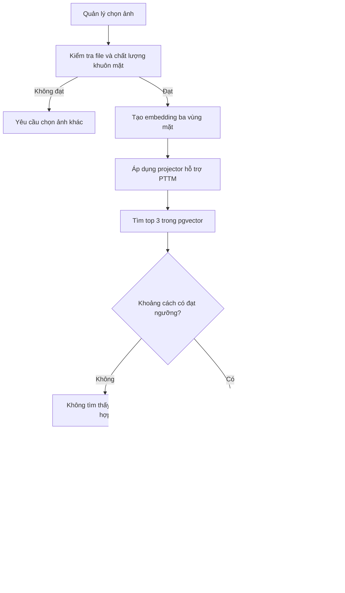
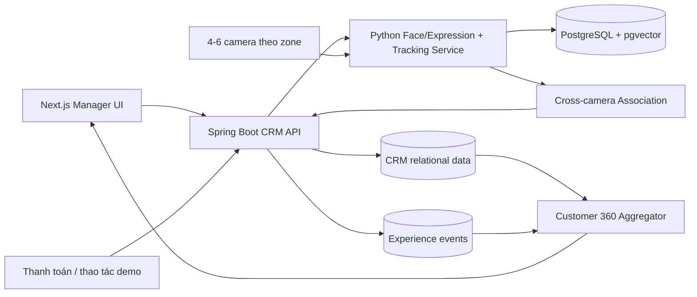
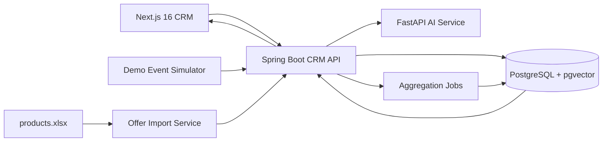
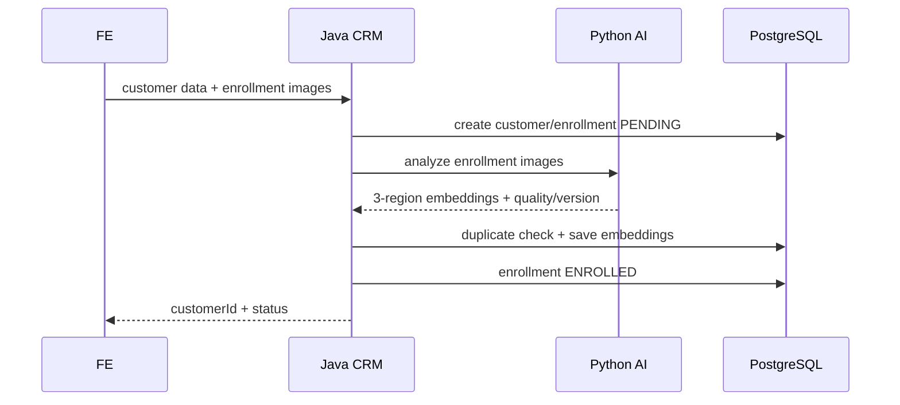
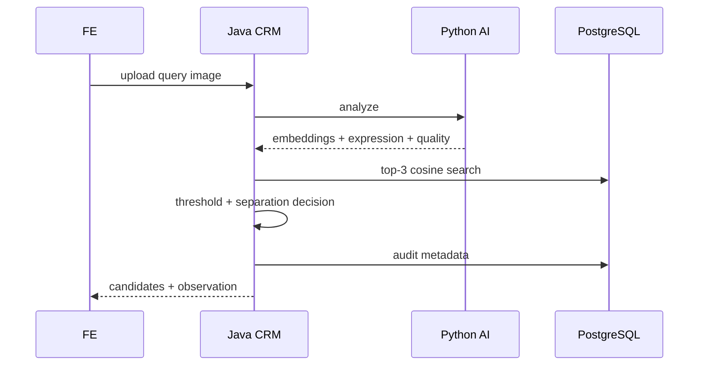
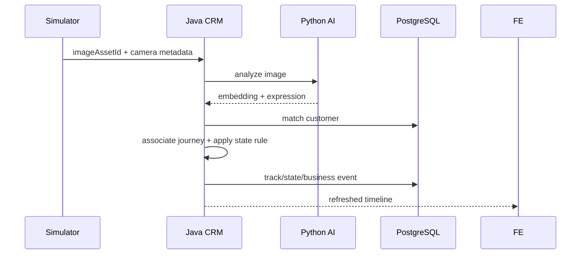

# KẾ HOẠCH TÍCH HỢP FACE SEARCH VÀ CUSTOMER 360 VÀO CRM

## Phạm vi: tìm khách hàng bằng ảnh, hồ sơ CRM hợp nhất và trải nghiệm trước/sau mua hàng

## 0. Quyết định thiết kế

Hệ thống được triển khai theo hướng **CRM dành cho người quản lý kết hợp mạng camera theo dõi hành trình khách hàng**. Customer 360 là nơi hợp nhất dữ liệu; các camera là nguồn tạo dữ liệu hành trình và trải nghiệm tại từng khu vực.

Luồng nghiệp vụ chính:

```text
Người quản lý tải ảnh khách hàng
→ hệ thống tìm ứng viên bằng khuôn mặt
→ người quản lý xác nhận kết quả
→ mở hồ sơ Customer 360
→ xem nhân viên từng tư vấn
→ xem lịch sử tương tác và mua hàng
→ xem tín hiệu trải nghiệm hiện tại
→ xem trạng thái trước và sau từng giao dịch
```

Phương án triển khai sử dụng **4 camera tối thiểu và 6 camera khuyến nghị**. Hệ thống thực hiện tracking trong từng camera, sau đó liên kết các track giữa camera bằng khuôn mặt, thời gian, tuyến di chuyển và ngữ cảnh CRM/POS.

Thứ tự ưu tiên:

1. Face Search bằng ảnh.
2. Customer 360.
3. Liên kết khách hàng với đơn hàng và nhân viên tư vấn.
4. Lưu lịch sử trải nghiệm trước/sau mua.
5. Thu thập hành trình tự động từ hệ thống nhiều camera.
6. Tổng hợp KPI theo zone, điểm nghẽn và toàn hành trình.

---

## 1. Mục tiêu nghiệp vụ

### 1.1. Bài toán

Người quản lý có ảnh của một khách hàng nhưng không nhớ tên, số điện thoại hoặc mã khách hàng. Thay vì dò thủ công, người quản lý tải ảnh lên CRM để:

- xác định khách hàng có khả năng trùng khớp;
- mở đúng hồ sơ CRM;
- biết khách từng được nhân viên nào tư vấn;
- xem sản phẩm, đơn hàng và tổng giá trị mua;
- xem lịch sử tương tác;
- xem tín hiệu biểu hiện trong ảnh vừa tải;
- so sánh trạng thái trải nghiệm trước và sau giao dịch nếu đủ dữ liệu.

### 1.2. Giá trị mang lại

- Rút ngắn thời gian tìm hồ sơ.
- Hợp nhất dữ liệu nhận diện, bán hàng và trải nghiệm tại một màn hình.
- Giúp người quản lý hiểu bối cảnh trước khi xử lý khiếu nại hoặc chăm sóc lại.
- Tạo nền dữ liệu để đánh giá chất lượng quy trình tư vấn.
- Chứng minh giá trị của mô hình nhận diện khuôn mặt sau phẫu thuật thẩm mỹ.

### 1.3. Điều hệ thống không được tuyên bố

- Không khẳng định AI đọc chính xác cảm xúc nội tâm.
- Không coi một ảnh đơn lẻ là bằng chứng khách hài lòng hay không hài lòng.
- Không tự động thưởng, phạt hoặc quy trách nhiệm cho nhân viên.
- Không tự động xác nhận danh tính khi độ tin cậy không đạt ngưỡng.
- Không coi một camera hoặc một biểu hiện đơn lẻ là đại diện cho toàn bộ hành trình.
- Không liên kết hai track giữa camera nếu điểm tin cậy không đạt ngưỡng.

Trong giao diện và báo cáo nên dùng cụm từ **trạng thái trải nghiệm được suy luận** hoặc **tín hiệu biểu hiện**, không dùng “cảm xúc thật của khách hàng”.

---

## 2. Đối chiếu với hệ thống hiện tại

| Năng lực | Hiện tại | Sau khi triển khai |
|---|---|---|
| Đăng ký khuôn mặt | Python đã tạo embedding theo ba vùng mặt | Giữ lại, bổ sung phiên bản mô hình và kiểm soát chất lượng |
| Nhận diện từ ảnh | Python `/checkin` đã tìm khách gần nhất | Đổi thành Face Search trả `customerId`, top candidates, score và quyết định theo ngưỡng |
| Hỗ trợ khuôn mặt sau PTTM | Đã có projector/trọng số từ C2FPW | Tiếp tục dùng cho identity matching |
| Biểu hiện hiện tại | Chỉ trả `dominant_emotion` | Trả vector xác suất, chất lượng, thời điểm và ánh xạ sang trạng thái trải nghiệm |
| Hồ sơ khách hàng | Chỉ có tên, giới tính, tuổi, ảnh | Bổ sung Customer 360 tổng hợp đơn hàng, nhân viên và trải nghiệm |
| Đơn hàng | `leadName`, `leadPhone`, `assigned` là chuỗi | Bổ sung khóa ngoại `customer_id`, `staff_id` |
| Lịch sử tư vấn | Chưa có bảng chuẩn | Thêm `sales_interactions` |
| Trước/sau mua | Chưa lưu session/event | Thêm session, business event và experience event |
| Frontend | Có danh sách khách hàng, chưa có Face Search/360 | Thêm trang tìm bằng ảnh và hồ sơ 360 |
| Camera | Chưa có pipeline video hoàn chỉnh | 4 camera tối thiểu/6 camera khuyến nghị, tracking cục bộ và cross-camera association |

Khoảng trống cốt lõi hiện nay:

```text
Kết quả nhận diện
    chưa nối ổn định với customer_id
        → đơn hàng
        → nhân viên tư vấn
        → phiên trải nghiệm
        → trạng thái trước/sau mua
```

---

## 3. Phạm vi MVP

### 3.1. Có trong MVP

- Người quản lý tải một ảnh có một khuôn mặt chính.
- Hệ thống kiểm tra chất lượng ảnh.
- Hệ thống trả tối đa ba ứng viên gần nhất.
- Chỉ tự động đề xuất, người quản lý xác nhận trước khi mở hồ sơ.
- Mở trang Customer 360 của khách đã xác nhận.
- Hiển thị thông tin cơ bản, lịch sử đơn hàng và nhân viên từng tư vấn.
- Phân tích tín hiệu biểu hiện trong ảnh tìm kiếm.
- Hiển thị lịch sử trạng thái trải nghiệm đã lưu.
- Với giao dịch có đủ dữ liệu, hiển thị trạng thái trước và sau mua.
- Nếu thiếu dữ liệu, trả `NOT_ENOUGH_DATA`, không tự suy đoán.
- Ghi nhận hành trình qua các zone Entrance, Consultation, Service/Technical, Waiting, Checkout và Exit.
- Liên kết các track giữa camera thành một `journey_id` khi đủ độ tin cậy.

### 3.2. Ngoài MVP

- Mở rộng ngoài sáu camera hoặc ra ngoài phạm vi chi nhánh pilot.
- Theo dõi khách ở khu vực không được thông báo hoặc không thuộc mục đích đã phê duyệt.
- Xếp hạng nhân viên dựa trên biểu hiện khuôn mặt.
- Dự đoán doanh thu từ cảm xúc.
- Tự động xác định danh tính trong trường hợp mơ hồ.
- Dùng dữ liệu C2FPW để huấn luyện sáu trạng thái trải nghiệm.

---

## 4. Luồng nghiệp vụ chi tiết

### 4.1. Face Search



Quy tắc:

- Ảnh phải có đúng một khuôn mặt chính đủ rõ.
- Không lưu ảnh tìm kiếm mặc định.
- Kết quả nhận diện là **candidate**, không phải kết luận tuyệt đối.
- Phải hiển thị độ tương đồng/khoảng cách và cảnh báo khi gần ngưỡng.
- Trường hợp không chắc chắn phải ưu tiên `REVIEW_REQUIRED`.

Trạng thái kết quả:

| Mã | Ý nghĩa |
|---|---|
| `MATCHED` | Có ứng viên đạt ngưỡng và đủ tách biệt |
| `REVIEW_REQUIRED` | Có ứng viên nhưng độ chắc chắn chưa đủ để tự chọn |
| `NOT_FOUND` | Không ứng viên nào đạt ngưỡng |
| `LOW_QUALITY` | Ảnh không đủ chất lượng |
| `MULTIPLE_FACES` | Có nhiều khuôn mặt và không xác định được mặt chính |

### 4.2. Customer 360

Sau khi người quản lý xác nhận ứng viên, CRM tải một hồ sơ hợp nhất:

```text
Customer 360
├── Thông tin khách hàng
├── Ảnh đại diện và mức tin cậy nhận diện
├── Nhân viên đã/đang phụ trách
├── Lịch sử tương tác tư vấn
├── Lịch sử đơn hàng
├── Tín hiệu biểu hiện trong ảnh vừa tải
├── Lịch sử trạng thái trải nghiệm
└── Trạng thái trước/sau từng giao dịch
```

Không lưu “cảm xúc hiện tại” như một thuộc tính cố định của khách hàng. Nó phải luôn đi cùng:

- `observedAt`;
- nguồn ảnh/camera;
- `confidence`;
- `faceQuality`;
- phiên bản mô hình;
- cờ `inferred`.

### 4.3. Liên kết nhân viên tư vấn

Không dùng trường chuỗi `assigned` làm nguồn dữ liệu chính. Mỗi tương tác tư vấn phải có:

- `customer_id`;
- `staff_id`;
- `started_at`;
- `ended_at`;
- `channel`;
- `outcome`;
- ghi chú nếu có.

Một khách có thể được nhiều nhân viên tư vấn ở các thời điểm khác nhau. Customer 360 hiển thị:

- nhân viên phụ trách hiện tại;
- nhân viên tư vấn gần nhất;
- toàn bộ lịch sử tư vấn;
- đơn hàng phát sinh sau tương tác nào, nếu xác định được.

### 4.4. Trạng thái trước và sau mua hàng

Mốc nghiệp vụ chuẩn là `PAYMENT_SUCCESS`.

```text
Khoảng trước mua                 Mốc giao dịch              Khoảng sau mua
[-120 giây, -10 giây]          PAYMENT_SUCCESS            [+10 giây, +120 giây]
       ↓                                                     ↓
PRE_PURCHASE_STATE                                  POST_PURCHASE_STATE
```

Quy tắc ban đầu:

- `prePurchaseState`: trạng thái có độ tin cậy cao nhất trong 120 giây trước thanh toán, loại bỏ 10 giây sát mốc để tránh nhiễu thao tác.
- `postPurchaseState`: trạng thái có độ tin cậy cao nhất từ 10 đến 120 giây sau thanh toán.
- Nếu khách rời camera sớm, dùng trạng thái ổn định cuối cùng sau mốc thanh toán.
- Nếu không có ít nhất 10 giây dữ liệu hợp lệ trong một cửa sổ, trả `NOT_ENOUGH_DATA`.
- Chỉ so sánh hai trạng thái thuộc cùng một `customer_id`, cùng một phiên và cùng một giao dịch.

Kết quả so sánh:

| Mã | Điều kiện |
|---|---|
| `IMPROVED` | Sau mua tích cực hơn trước mua |
| `UNCHANGED` | Không có thay đổi đáng kể |
| `DECLINED` | Sau mua tiêu cực hơn trước mua |
| `NOT_ENOUGH_DATA` | Thiếu dữ liệu một hoặc cả hai phía |

Đây là chỉ báo trải nghiệm quanh giao dịch, không chứng minh giao dịch là nguyên nhân duy nhất gây thay đổi.

---

## 5. Mô hình sáu trạng thái trải nghiệm

DeepFace chỉ cung cấp các lớp biểu hiện cơ bản:

```text
happy, neutral, angry, sad, fear, surprise, disgust
```

Sáu trạng thái nghiệp vụ không phải sáu nhãn đầu ra trực tiếp của DeepFace. Chúng được suy luận từ:

```text
expression probabilities
+ diễn biến theo thời gian
+ mốc giao dịch/tư vấn
+ thời gian chờ
+ kết quả nghiệp vụ
= experience state
```

| Trạng thái | Định nghĩa triển khai | Bằng chứng tối thiểu |
|---|---|---|
| `DELIGHTED` | Tín hiệu tích cực rõ và duy trì, thường xuất hiện sau kết quả thuận lợi | `happy` cao ổn định và chất lượng ảnh đạt ngưỡng; ưu tiên có `PAYMENT_SUCCESS`/`SERVICE_COMPLETED` |
| `ENGAGED` | Khách đang chú ý và tham gia tương tác, chưa đồng nghĩa hài lòng | Đang trong phiên tư vấn, trạng thái ổn định, không có tín hiệu tiêu cực mạnh |
| `CONFUSED` | Có dấu hiệu không chắc chắn trong một quy trình chưa tiến triển | Biến động `surprise/fear/neutral` kết hợp tư vấn kéo dài, yêu cầu giải thích lại hoặc chưa có bước tiếp theo |
| `IMPATIENT` | Khách có dấu hiệu khó chịu khi thời gian chờ vượt ngưỡng | `wait_duration > SLA` và tín hiệu tiêu cực duy trì |
| `DISSATISFIED` | Tín hiệu tiêu cực rõ và kéo dài, có thể đi cùng kết quả bất lợi | `angry/sad/disgust` duy trì; tăng độ tin cậy nếu có `CANCELLED`, `REFUND`, `COMPLAINT` |
| `NEUTRAL` | Không đủ bằng chứng cho trạng thái khác | Trạng thái mặc định khi tín hiệu yếu, mâu thuẫn hoặc thiếu ngữ cảnh |

Nguyên tắc an toàn:

- Không dùng một frame để kết luận.
- Làm mượt xác suất trong cửa sổ tối thiểu 3–5 giây.
- Khi confidence thấp, trả `NEUTRAL` hoặc `UNKNOWN`.
- `IMPATIENT` bắt buộc có ngữ cảnh thời gian chờ.
- `CONFUSED` bắt buộc có ngữ cảnh quy trình/tư vấn.
- `DELIGHTED` và `DISSATISFIED` cần tín hiệu duy trì, không dựa trên một nụ cười hoặc một nét cau mày.

---

## 6. Vai trò của C2FPW

C2FPW chỉ được dùng trong nhánh **nhận diện danh tính sau phẫu thuật thẩm mỹ**:

```text
C2FPW
→ huấn luyện/tinh chỉnh projector hoặc trọng số vùng mặt
→ tăng độ bền của embedding trước/sau PTTM
→ hỗ trợ Face Search
```

C2FPW không được dùng để:

- huấn luyện `DELIGHTED`, `ENGAGED`, `CONFUSED`, `IMPATIENT`, `DISSATISFIED`, `NEUTRAL`;
- đánh giá mức hài lòng;
- tạo dữ liệu trước/sau mua hàng;
- chứng minh hiệu quả nghiệp vụ CRM.

Để huấn luyện hoặc hiệu chỉnh sáu trạng thái cần dữ liệu phiên tư vấn/quầy có:

- chuỗi thời gian;
- nhãn của nhiều người đánh giá;
- mốc thanh toán và sự kiện nghiệp vụ;
- thời gian chờ;
- điều kiện ánh sáng và góc camera thực tế.

Trong MVP nên dùng rule engine có giải thích, chưa huấn luyện mô hình sáu lớp khi chưa có bộ dữ liệu phù hợp.

---

## 7. Kiến trúc mục tiêu



Phân trách nhiệm:

### Python AI Backend

- kiểm tra ảnh;
- phát hiện và căn chỉnh khuôn mặt;
- tạo embedding ba vùng;
- áp dụng projector;
- tìm top candidates;
- trả vector xác suất biểu hiện;
- tracking cục bộ riêng trong từng camera;
- tạo `global_person_id/journey_id` bằng cross-camera association;
- phát event vào/ra zone và event biểu hiện theo thời gian.

### Java CRM Backend

- xác thực và phân quyền;
- gọi Python bằng DTO có kiểu;
- áp dụng ngưỡng và quyết định `MATCHED/REVIEW_REQUIRED`;
- quản lý khách hàng, nhân viên, tương tác và đơn hàng;
- sessionization;
- rule engine sáu trạng thái;
- tính trước/sau mua;
- tổng hợp Customer 360;
- audit log.

### Next.js Frontend

- upload/preview ảnh;
- hiển thị ứng viên và yêu cầu xác nhận;
- trang Customer 360;
- timeline tư vấn, đơn hàng và trải nghiệm;
- trạng thái thiếu dữ liệu/cảnh báo độ tin cậy;
- không hiển thị nhãn AI như một sự thật tuyệt đối.

---

## 8. Mô hình dữ liệu

### 8.1. Sửa bảng đơn hàng

Giữ các trường cũ để tương thích trong giai đoạn chuyển đổi, đồng thời bổ sung:

```sql
ALTER TABLE so_sales_order
    ADD COLUMN customer_id INTEGER REFERENCES customers(id),
    ADD COLUMN staff_id INTEGER REFERENCES users(id),
    ADD COLUMN paid_at TIMESTAMPTZ;

CREATE INDEX idx_sale_order_customer
    ON so_sales_order(customer_id, created_at DESC);
```

`lead_name` và `assigned` chỉ là dữ liệu legacy; báo cáo mới phải ưu tiên khóa ngoại.

### 8.2. Lịch sử tư vấn

```sql
CREATE TABLE sales_interactions (
    id BIGSERIAL PRIMARY KEY,
    customer_id INTEGER NOT NULL REFERENCES customers(id),
    staff_id INTEGER REFERENCES users(id),
    channel VARCHAR(30) NOT NULL,
    started_at TIMESTAMPTZ NOT NULL,
    ended_at TIMESTAMPTZ,
    outcome VARCHAR(30),
    notes TEXT,
    created_at TIMESTAMPTZ NOT NULL DEFAULT now()
);
```

`channel`: `COUNTER`, `PHONE`, `CHAT`, `OTHER`.

`outcome`: `FOLLOW_UP`, `PURCHASED`, `NO_PURCHASE`, `COMPLAINT`, `CANCELLED`.

### 8.3. Phiên trải nghiệm

```sql
CREATE TABLE experience_sessions (
    id UUID PRIMARY KEY,
    customer_id INTEGER REFERENCES customers(id),
    journey_id UUID,
    branch_id VARCHAR(50),
    entry_camera_id VARCHAR(50),
    started_at TIMESTAMPTZ NOT NULL,
    ended_at TIMESTAMPTZ,
    source VARCHAR(20) NOT NULL,
    status VARCHAR(30) NOT NULL,
    recognition_confidence DOUBLE PRECISION,
    model_version VARCHAR(100)
);
```

`source`: `IMPORTED_IMAGE`, `CAMERA_NETWORK`, `MANUAL_DEMO`.

Mỗi track cục bộ của từng camera được lưu riêng:

```sql
CREATE TABLE camera_tracks (
    id UUID PRIMARY KEY,
    session_id UUID REFERENCES experience_sessions(id),
    camera_id VARCHAR(50) NOT NULL,
    zone_code VARCHAR(50) NOT NULL,
    local_track_id VARCHAR(100) NOT NULL,
    customer_id INTEGER REFERENCES customers(id),
    first_seen_at TIMESTAMPTZ NOT NULL,
    last_seen_at TIMESTAMPTZ NOT NULL,
    recognition_distance DOUBLE PRECISION,
    association_confidence DOUBLE PRECISION,
    association_method VARCHAR(50)
);
```

`local_track_id` chỉ có ý nghĩa trong một camera. `session_id/journey_id` mới là khóa nối hành trình giữa nhiều camera.

### 8.4. Event biểu hiện và trạng thái

```sql
CREATE TABLE experience_state_events (
    id BIGSERIAL PRIMARY KEY,
    session_id UUID NOT NULL REFERENCES experience_sessions(id),
    camera_track_id UUID REFERENCES camera_tracks(id),
    customer_id INTEGER REFERENCES customers(id),
    camera_id VARCHAR(50),
    zone_code VARCHAR(50),
    observed_at TIMESTAMPTZ NOT NULL,
    basic_expression VARCHAR(30),
    experience_state VARCHAR(30) NOT NULL,
    confidence DOUBLE PRECISION NOT NULL,
    face_quality DOUBLE PRECISION,
    expression_probabilities JSONB,
    evidence JSONB,
    model_version VARCHAR(100),
    rule_version VARCHAR(100)
);
```

Các trường `camera_id`, `zone_code` và `camera_track_id` cho phép truy ngược mỗi trạng thái về đúng camera/frame stream đã tạo ra nó.

Các lần chuyển camera được lưu để kiểm tra cross-camera association:

```sql
CREATE TABLE camera_transitions (
    id BIGSERIAL PRIMARY KEY,
    session_id UUID NOT NULL REFERENCES experience_sessions(id),
    from_track_id UUID NOT NULL REFERENCES camera_tracks(id),
    to_track_id UUID NOT NULL REFERENCES camera_tracks(id),
    transitioned_at TIMESTAMPTZ NOT NULL,
    face_score DOUBLE PRECISION,
    time_score DOUBLE PRECISION,
    route_score DOUBLE PRECISION,
    context_score DOUBLE PRECISION,
    final_score DOUBLE PRECISION NOT NULL,
    decision VARCHAR(30) NOT NULL,
    rule_version VARCHAR(100) NOT NULL
);
```

`evidence` lưu lý do suy luận, ví dụ:

```json
{
  "waitSeconds": 182,
  "waitSlaSeconds": 120,
  "negativeSignalSeconds": 18,
  "businessEvent": "PAYMENT_PENDING"
}
```

### 8.5. Sự kiện nghiệp vụ

```sql
CREATE TABLE customer_business_events (
    id BIGSERIAL PRIMARY KEY,
    session_id UUID REFERENCES experience_sessions(id),
    customer_id INTEGER REFERENCES customers(id),
    order_id INTEGER REFERENCES so_sales_order(so_id),
    event_type VARCHAR(40) NOT NULL,
    occurred_at TIMESTAMPTZ NOT NULL,
    metadata JSONB
);
```

Các event cần cho demo:

```text
CONSULTATION_STARTED
CONSULTATION_ENDED
WAITING_STARTED
WAITING_ENDED
PAYMENT_PENDING
PAYMENT_SUCCESS
PAYMENT_FAILED
SERVICE_COMPLETED
COMPLAINT
CANCELLED
REFUND
```

### 8.6. Kết quả trước/sau mua

```sql
CREATE TABLE purchase_experience_summary (
    order_id INTEGER PRIMARY KEY REFERENCES so_sales_order(so_id),
    customer_id INTEGER NOT NULL REFERENCES customers(id),
    session_id UUID NOT NULL REFERENCES experience_sessions(id),
    pre_purchase_state VARCHAR(30),
    pre_confidence DOUBLE PRECISION,
    post_purchase_state VARCHAR(30),
    post_confidence DOUBLE PRECISION,
    change_type VARCHAR(30) NOT NULL,
    computed_at TIMESTAMPTZ NOT NULL,
    rule_version VARCHAR(100) NOT NULL
);
```

### 8.7. Audit tìm kiếm bằng ảnh

Chỉ lưu metadata, không lưu ảnh tìm kiếm mặc định:

```sql
CREATE TABLE face_search_audit (
    id UUID PRIMARY KEY,
    requested_by INTEGER NOT NULL REFERENCES users(id),
    requested_at TIMESTAMPTZ NOT NULL,
    result_status VARCHAR(30) NOT NULL,
    selected_customer_id INTEGER REFERENCES customers(id),
    top_distance DOUBLE PRECISION,
    face_quality DOUBLE PRECISION,
    confirmed_by_user BOOLEAN NOT NULL DEFAULT false,
    model_version VARCHAR(100)
);
```

---

## 9. Thiết kế API

### 9.1. Face Search

```http
POST /api/v1/customers/identify
Content-Type: multipart/form-data
Authorization: Bearer <token>

file=<image>
```

Response:

```json
{
  "searchId": "5e45974c-a7c8-4425-8708-1fa5b6cbd76e",
  "status": "REVIEW_REQUIRED",
  "faceQuality": 0.91,
  "currentObservation": {
    "basicExpression": "neutral",
    "experienceState": "NEUTRAL",
    "confidence": 0.62,
    "observedAt": "2026-07-25T19:00:00+07:00",
    "inferred": true
  },
  "candidates": [
    {
      "customerId": 128,
      "name": "Nguyen Van A",
      "avatarUrl": "/media/customers/128",
      "distance": 0.21,
      "similarity": 0.79
    }
  ]
}
```

Lưu ý: công thức `similarity` phải được định nghĩa theo metric đang dùng; không mặc định mọi cosine distance đều chuyển thành `1 - distance` trong báo cáo chính thức nếu chưa hiệu chỉnh.

### 9.2. Xác nhận ứng viên

```http
POST /api/v1/customers/identify/{searchId}/confirm
Content-Type: application/json

{
  "customerId": 128
}
```

API xác nhận:

- kiểm tra người dùng có quyền quản lý;
- ghi audit;
- không thay đổi embedding của khách;
- trả URL hoặc dữ liệu tóm tắt để mở Customer 360.

### 9.3. Customer 360

```http
GET /api/v1/customers/{customerId}/profile-360
```

Response:

```json
{
  "customer": {
    "id": 128,
    "name": "Nguyen Van A",
    "gender": "MALE",
    "age": 34,
    "avatarUrl": "/media/customers/128"
  },
  "recognition": {
    "searchId": "5e45974c-a7c8-4425-8708-1fa5b6cbd76e",
    "distance": 0.21,
    "confirmedByManager": true
  },
  "currentObservation": {
    "experienceState": "NEUTRAL",
    "confidence": 0.62,
    "observedAt": "2026-07-25T19:00:00+07:00",
    "source": "IMPORTED_IMAGE"
  },
  "salesSummary": {
    "orderCount": 3,
    "totalAmount": 42500000,
    "lastPurchaseAt": "2026-07-20T15:10:00+07:00"
  },
  "recentStaff": [
    {
      "staffId": 7,
      "staffName": "Tran Thi B",
      "lastInteractionAt": "2026-07-20T14:25:00+07:00",
      "outcome": "PURCHASED"
    }
  ],
  "orders": [],
  "interactions": [],
  "experienceTimeline": [],
  "purchaseExperience": []
}
```

### 9.4. Event phục vụ demo/camera

```http
POST /api/v1/experience/sessions
POST /api/v1/demo/camera-events/replay
POST /api/v1/experience/sessions/{sessionId}/observations
POST /api/v1/experience/sessions/{sessionId}/business-events
POST /api/v1/experience/sessions/{sessionId}/close
```

Request replay không chứa kết quả nhận diện hoặc trạng thái:

```json
{
  "scenarioId": "SCENARIO-02",
  "cameraId": "CAM-02",
  "zoneCode": "CONSULTATION",
  "localTrackId": "CAM02-T015",
  "capturedAt": "2026-07-25T10:00:30+07:00",
  "imageAssetId": "IMG014"
}
```

Java lấy ảnh theo `imageAssetId`, gửi ảnh sang Python để nhận diện và phân tích expression, sau đó mới tạo observation. Các API này cho phép synthetic camera event và POS simulator đi qua đúng pipeline nghiệp vụ.

---

## 10. Thay đổi cụ thể theo project

### 10.1. `CRM-system-be` — Python

Sửa luồng `services/checkin.py`:

- trả `customer_id`; hiện code đã lấy được nhưng chưa đưa vào response cuối;
- trả top ba ứng viên thay vì chỉ best match;
- trả `faceQuality`;
- trả toàn bộ `emotion` probabilities;
- thêm `modelVersion`;
- tách hàm nhận diện khỏi khái niệm “check-in”;
- không ghi ảnh debug cố định;
- xóa file tạm sau khi xử lý;
- hiệu chỉnh threshold trên tập validation, không coi `0.30` là đúng tuyệt đối.

API nội bộ mục tiêu:

```text
POST /internal/v1/faces/search
POST /internal/v1/faces/register
POST /internal/v1/expressions/analyze
```

Chuẩn hóa tên vùng mặt thành:

```text
upper
mid
lower
```

Hiện Python dùng chữ thường trong khi native query Java đang dùng `Upper/Mid/Lower`; phải thống nhất để tránh truy vấn không khớp.

### 10.2. `CRM-system-be-java` — Spring Boot

Thực hiện:

- tạo migration cho các bảng ở mục 8;
- bổ sung quan hệ `SaleOrder.customer` và `SaleOrder.staff`;
- tạo entity/repository/service cho `SalesInteraction`;
- thay raw `Map` trong `CustomerController` bằng DTO có kiểu;
- tạo `FaceSearchController` hoặc endpoint `/customers/identify`;
- tạo `Customer360Service`;
- tạo `ExperienceSessionService`;
- tạo `ExperienceStateRuleEngine`;
- tạo `PurchaseExperienceService`;
- kiểm tra quyền `MANAGER/ADMIN` cho Face Search và Customer 360;
- ghi audit nhưng không lưu ảnh tìm kiếm mặc định;
- map lỗi Python thành HTTP status rõ ràng.

Các lớp đề xuất:

```text
api/dto/face/FaceSearchResponse.java
api/dto/customer/Customer360Response.java
api/controller/FaceSearchController.java
api/controller/Customer360Controller.java
service/Customer360Service.java
service/ExperienceSessionService.java
service/ExperienceStateRuleEngine.java
service/PurchaseExperienceService.java
entity/SalesInteraction.java
entity/ExperienceSession.java
entity/ExperienceStateEvent.java
entity/CustomerBusinessEvent.java
entity/PurchaseExperienceSummary.java
```

### 10.3. `CRM-system-fe` — Next.js

Thêm hai màn hình:

```text
/customers/face-search
/customers/[id]/360
```

Màn Face Search:

- vùng kéo/thả ảnh;
- preview;
- cảnh báo quyền sử dụng ảnh;
- trạng thái đang xử lý;
- danh sách tối đa ba ứng viên;
- ảnh CRM, tên, mã khách, score;
- nút xác nhận/mở hồ sơ;
- kết quả không tìm thấy hoặc ảnh kém.

Màn Customer 360:

- header thông tin khách;
- card kết quả nhận diện;
- card tín hiệu hiện tại có timestamp/confidence;
- card số đơn và tổng chi tiêu;
- danh sách nhân viên từng tư vấn;
- timeline tương tác;
- bảng đơn hàng;
- bảng trước/sau mua;
- trạng thái `NOT_ENOUGH_DATA`.

Không dùng màu đỏ/xanh như một kết luận đạo đức về khách hoặc nhân viên. Luôn hiển thị tooltip: “Trạng thái do AI suy luận từ tín hiệu quan sát và ngữ cảnh”.

---

## 11. Thiết kế hệ thống nhiều camera

### 11.1. Số lượng và vị trí

Phương án tối thiểu dùng 4 camera:

| Camera | Zone | Mục đích |
|---|---|---|
| `CAM-01` | `ENTRANCE` | Bắt đầu hành trình, nhận diện ứng viên và thời điểm vào |
| `CAM-02` | `CONSULTATION` | Theo dõi tương tác với sale và trạng thái `ENGAGED/CONFUSED` |
| `CAM-03` | `SERVICE_TECH` | Theo dõi chờ xử lý, sự cố kỹ thuật và `IMPATIENT/DISSATISFIED` |
| `CAM-04` | `CHECKOUT` | Liên kết POS, xác định trước/sau mua và kết quả giao dịch |

Phương án khuyến nghị dùng 6 camera:

| Camera bổ sung | Zone | Mục đích |
|---|---|---|
| `CAM-05` | `WAITING` | Đo thời gian chờ độc lập, giảm điểm mù |
| `CAM-06` | `EXIT` | Xác định kết thúc hành trình và trạng thái cuối |

Camera phải được bố trí sao cho hướng di chuyển giữa hai zone liền kề có khoảng thời gian hợp lý và hạn chế vùng mù. Không yêu cầu các camera có cùng trường nhìn.

### 11.2. Hành trình mục tiêu

```text
ENTRANCE
→ CONSULTATION
→ SERVICE_TECH hoặc WAITING (tùy chọn)
→ CHECKOUT hoặc EXIT_WITHOUT_PURCHASE
→ EXIT
```

Một khách không bắt buộc đi qua mọi zone. Hành trình phải hỗ trợ các nhánh:

```text
ENTRANCE → CONSULTATION → EXIT
ENTRANCE → CONSULTATION → CHECKOUT → EXIT
ENTRANCE → SERVICE_TECH → WAITING → EXIT
```

### 11.3. Cross-camera association

Mỗi camera tạo `local_track_id`. Dịch vụ association nối các track thành `journey_id` dựa trên điểm tổng hợp:

```text
association_score =
w1 × face_similarity
+ w2 × time_compatibility
+ w3 × camera_transition_probability
+ w4 × CRM/POS_context
```

Quy tắc:

1. Chỉ so sánh track ở các camera có tuyến chuyển tiếp hợp lệ.
2. Ưu tiên face embedding khi khuôn mặt đủ chất lượng.
3. Dùng cửa sổ thời gian di chuyển giữa hai zone để loại ứng viên không hợp lý.
4. Nếu đã nhận diện thành viên, `customer_id` là bằng chứng mạnh nhưng vẫn kiểm tra xung đột.
5. Nếu hai ứng viên gần điểm nhau, gắn `ASSOCIATION_REVIEW_REQUIRED`.
6. Không ép liên kết; cho phép track chưa xác định.
7. Lưu score, thành phần score và phiên bản luật để audit.

Không dùng quần áo làm danh tính lâu dài. Đặc trưng ngoại hình chỉ được dùng hỗ trợ trong cùng một lần ghé và phải có thời hạn ngắn.

### 11.4. Liên kết CRM/POS

```text
journey_id
→ customer_id sau nhận diện/xác nhận
→ sales_interaction tại CONSULTATION
→ order_id tại CHECKOUT
→ PAYMENT_SUCCESS
→ trạng thái trước/sau mua
→ Customer 360
```

POS cung cấp `customer_id/order_id/paid_at`. Nếu POS không có `customer_id`, nhân viên chọn khách hoặc xác nhận ứng viên tại quầy; hệ thống không tự gắn khi chưa đủ tin cậy.

### 11.5. Tần suất xử lý

- Video/tracking tại mỗi camera: mục tiêu 10–15 FPS tùy phần cứng.
- Face embedding: khi track mới xuất hiện và khi có frame chất lượng tốt hơn.
- Expression analysis: 1–2 FPS trên track đủ chất lượng.
- Cross-camera association: chạy khi track mới xuất hiện hoặc track kết thúc.
- Gom event giống nhau theo cửa sổ 3–5 giây.
- Không lưu toàn bộ video trong MVP; ưu tiên event, embedding tạm thời và metadata.
- Hàng đợi phải tách theo `camera_id` để một camera lỗi không chặn toàn hệ thống.

### 11.6. Trạng thái kỹ thuật

```text
LOCAL_TRACK_CREATED
→ IDENTITY_CANDIDATE
→ ZONE_EVENT_CREATED
→ CROSS_CAMERA_MATCHED hoặc REVIEW_REQUIRED
→ JOURNEY_UPDATED
→ SESSION_COMPLETED
```

### 11.7. Chế độ nguồn dữ liệu

Hệ thống định nghĩa hai adapter, dùng chung output contract:

```text
CAMERA_STREAM
→ frame/video thật trong triển khai tương lai

SYNTHETIC_EVENT
→ ảnh thật + camera metadata tổng hợp trong demo
```

MVP của đồ án chạy `SYNTHETIC_EVENT`. Nhánh Python nhận diện và expression vẫn chạy thật; chỉ detection/tracking từ video được thay bằng `localTrackId`, zone và timestamp do simulator cung cấp.

Cấu hình:

```text
CAMERA_INPUT_MODE=SYNTHETIC_EVENT
DEMO_DATASET_PATH=./demo-data
DEMO_SEED=20260725
DEMO_SPEED=5
```

---

## 12. Kế hoạch dữ liệu demo

### 12.1. Nguyên tắc

Core của đồ án là:

```text
ảnh khuôn mặt thật
→ nhận diện customer thật
→ phân tích expression thật
→ kết hợp ngữ cảnh
→ trạng thái trải nghiệm
```

Do không có điều kiện quay video nhiều camera, hệ thống chỉ tổng hợp dữ liệu ở lớp orchestration:

| Thành phần | Nguồn |
|---|---|
| Ảnh khuôn mặt | Ảnh thật, có nguồn và quyền sử dụng rõ ràng |
| Face detection/embedding/matching | Python chạy thật |
| Expression probabilities | DeepFace chạy thật từ ảnh |
| `camera_id`, `zone_code` | Dữ liệu tổng hợp |
| `local_track_id` | Dữ liệu tổng hợp |
| Timestamp và tuyến di chuyển | Dữ liệu tổng hợp |
| Đơn hàng, nhân viên, POS event | Dữ liệu CRM tổng hợp |
| Cross-camera association | Hệ thống xử lý thật |
| Sáu trạng thái trải nghiệm | Java rule engine xử lý thật |
| Customer 360 | Hệ thống tổng hợp thật |

Không tạo sẵn `customer_id`, `journey_id` hoặc `experience_state` như kết quả cuối. Simulator chỉ gửi ảnh và metadata đầu vào.

### 12.2. Số lượng customer

MVP sử dụng đúng hai customer:

```text
CUST-DEMO-001
CUST-DEMO-002
```

Hai customer đủ để:

- chứng minh đăng ký và tìm kiếm khuôn mặt;
- kiểm tra không nhầm hai danh tính;
- nối một người qua nhiều camera giả lập;
- hiển thị hai Customer 360 khác nhau;
- tạo một hành trình mua thành công và một hành trình không hài lòng/không mua.

Kết quả với hai customer chỉ được trình bày là `proof of concept`, không phải độ chính xác tổng quát trên dân số thực tế.

Thêm một nhóm ảnh `UNKNOWN` không đăng ký vào CRM để kiểm thử `NOT_FOUND`. Nhóm này không được tính là customer thứ ba.

### 12.3. Nguồn ảnh

#### Phương án A — khuyến nghị

Sử dụng hai tình nguyện viên có đồng ý:

- dễ lấy nhiều góc và biểu hiện;
- có thể đăng ký 3–5 ảnh/người;
- có thể tạo ảnh truy vấn khác ảnh đăng ký;
- kiểm soát được quyền sử dụng;
- phù hợp nhất nếu ảnh hoặc báo cáo phải công khai.

#### Phương án B — fallback bằng người nổi tiếng

Nếu không thể lấy ảnh tình nguyện viên, dùng hai diễn viên:

```text
CUST-DEMO-001 = Keanu Reeves
CUST-DEMO-002 = Emma Watson
```

Nguồn tìm ảnh:

- [Wikimedia Commons — Keanu Reeves](https://commons.wikimedia.org/wiki/Category:Keanu_Reeves)
- [Wikimedia Commons — Emma Watson](https://commons.wikimedia.org/wiki/Category:Emma_Watson)
- [Portrait photographs of Emma Watson](https://commons.wikimedia.org/wiki/Category:Portrait_photographs_of_Emma_Watson)

Không lấy ảnh ngẫu nhiên từ Google Images, Pinterest, Facebook, báo điện tử hoặc ảnh cắt từ phim.

Wikimedia Commons chứa nhiều giấy phép khác nhau. Trước khi tải từng ảnh phải mở trang `File:` và ghi lại:

- tên file;
- URL trang file;
- tác giả;
- giấy phép;
- URL giấy phép;
- yêu cầu attribution;
- ngày tải;
- thay đổi đã thực hiện như crop/resize;
- cảnh báo personality rights nếu có.

Creative Commons/Wikimedia chỉ giải quyết giấy phép của tác phẩm theo điều kiện trên trang file; quyền nhân thân/hình ảnh của người trong ảnh có thể vẫn tồn tại. Vì vậy bộ ảnh diễn viên chỉ dùng cho demo học thuật cục bộ, không dùng để quảng cáo, triển khai thương mại hoặc ngụ ý người đó là khách hàng thật hay xác nhận sản phẩm.

Trong UI phải có nhãn:

```text
DEMO PROFILE — SYNTHETIC CRM DATA
```

Tên, đơn hàng, nhân viên tư vấn và trạng thái đều là tình huống giả lập, không phải thông tin thực của diễn viên.

### 12.4. Số ảnh cho mỗi customer

Mỗi customer chuẩn bị:

| Nhóm | Số lượng | Mục đích |
|---|---:|---|
| `enrollment` | 3 | Tạo embedding đăng ký |
| `identity_query` | 3 | Face Search, ảnh khác enrollment |
| `positive_observation` | 2 | Tạo tín hiệu tích cực nếu DeepFace thực sự nhận ra |
| `neutral_observation` | 2 | Trạng thái nền và các tình huống cần ngữ cảnh |
| `negative_or_uncertain_observation` | 2 | Thử tín hiệu tiêu cực/không chắc chắn nếu tìm được ảnh phù hợp |
| Tổng mục tiêu | 12 ảnh | Cho một customer |

Tổng dữ liệu mục tiêu:

```text
2 customer × 12 ảnh = 24 ảnh
+ 3–5 ảnh UNKNOWN
= 27–29 ảnh
```

Không đưa cùng một file vào cả enrollment và identity query. Nếu chỉ crop/resize từ cùng một ảnh gốc thì vẫn được coi là cùng một ảnh và không dùng để chứng minh nhận diện.

Điều kiện kỹ thuật của ảnh:

- chỉ có một khuôn mặt chính;
- mặt không bị che quá nhiều;
- kích thước mặt tối thiểu 160 × 160 pixel sau crop;
- có ảnh chính diện và hơi nghiêng;
- tránh ảnh đã chỉnh sửa quá mạnh;
- không dùng watermark che khuôn mặt;
- lưu ảnh gốc và ảnh crop riêng;
- tính checksum để kiểm soát file trùng.

### 12.5. Quy trình chọn ảnh biểu hiện

Không gán trước ảnh là `DELIGHTED`, `CONFUSED` hoặc `DISSATISFIED` chỉ bằng quan sát chủ quan.

Quy trình:

1. Tải ảnh hợp lệ và ghi source manifest.
2. Chạy `DeepFace.analyze(actions=["emotion"])`.
3. Lưu toàn bộ vector xác suất.
4. Loại ảnh không phát hiện được mặt hoặc `faceQuality` thấp.
5. Phân nhóm theo output thực tế: positive, neutral, negative/uncertain.
6. Chọn ảnh phục vụ scenario sau khi đã chạy thử.
7. Không sửa probability để ép ảnh vào scenario.

Việc chọn ảnh theo output chỉ phục vụ một demo xác định, không được dùng để báo accuracy hoặc F1 của emotion model.

Sáu trạng thái vẫn được tạo bằng ngữ cảnh:

```text
neutral/uncertain expression
+ consultation kéo dài
+ chưa tiến triển
→ CONFUSED

neutral/negative expression
+ WAITING vượt SLA
→ IMPATIENT

positive expression
+ PAYMENT_SUCCESS
→ DELIGHTED
```

Không bắt buộc cả hai customer phải thể hiện đủ sáu trạng thái. Toàn bộ bộ scenario phải bao phủ sáu trạng thái, đồng thời có `UNKNOWN/NOT_ENOUGH_DATA`.

### 12.6. Cấu trúc thư mục

```text
demo-data/
├── README.md
├── source_manifest.csv
├── customers.json
├── images/
│   ├── CUST-DEMO-001/
│   │   ├── enrollment/
│   │   ├── query/
│   │   └── observations/
│   ├── CUST-DEMO-002/
│   │   ├── enrollment/
│   │   ├── query/
│   │   └── observations/
│   └── unknown/
├── crm/
│   ├── staff.json
│   ├── interactions.json
│   └── orders.json
├── journeys/
│   ├── scenario_01_successful_purchase.json
│   ├── scenario_02_confused_then_purchase.json
│   ├── scenario_03_long_wait.json
│   ├── scenario_04_dissatisfied_exit.json
│   ├── scenario_05_unknown_customer.json
│   └── scenario_06_ambiguous_association.json
└── expected/
    └── journey_ground_truth.json
```

`source_manifest.csv`:

```csv
asset_id,customer_code,purpose,source_page,author,license,license_url,downloaded_at,sha256,notes
IMG001,CUST-DEMO-001,enrollment,https://commons.wikimedia.org/wiki/File:...,Author,CC-BY-SA-4.0,https://creativecommons.org/licenses/by-sa/4.0/,2026-07-25,...,cropped
```

Không commit ảnh nếu giấy phép không cho phép phân phối lại theo cách project đang phát hành. Khi đó chỉ commit manifest và script tải có kiểm tra thủ công.

### 12.7. Dữ liệu CRM và lịch sử mua hàng

Thông tin CRM của hai customer là dữ liệu tổng hợp:

| Dữ liệu | CUST-DEMO-001 | CUST-DEMO-002 |
|---|---:|---:|
| Đơn hàng lịch sử | 5 | 4 |
| Tương tác tư vấn | 7 | 6 |
| Nhân viên từng tư vấn | 2 | 2 |
| Khiếu nại/hoàn tiền | 0–1 | 1 |
| Giao dịch phát sinh trong demo | 1 | 0–1 |

Mỗi order phải có:

```text
order_id
customer_id
staff_id
product_name
amount
created_at
paid_at
status
```

Mỗi interaction phải có:

```text
customer_id
staff_id
channel
started_at
ended_at
outcome
notes
```

Ngày, sản phẩm, số tiền và nội dung tư vấn không được lấy từ đời thực của diễn viên. Tất cả đều do seed script tạo và phải có cờ:

```text
is_demo_data = true
```

### 12.8. Synthetic camera event

Mỗi event chứa ảnh thật và metadata camera tổng hợp:

```json
{
  "scenarioId": "SCENARIO-02",
  "cameraId": "CAM-02",
  "zoneCode": "CONSULTATION",
  "localTrackId": "CAM02-T015",
  "capturedAt": "2026-07-25T10:00:30+07:00",
  "imageAssetId": "IMG014",
  "imagePath": "images/CUST-DEMO-001/observations/uncertain_01.jpg",
  "businessContext": {
    "event": "FINANCING_EXPLAINED"
  }
}
```

Simulator không gửi:

```text
customerId
journeyId
dominantExpression
experienceState
```

Python phải tự tạo recognition và expression output. Java phải tự tạo journey và experience state.

### 12.9. Sáu journey scenario

#### `SCENARIO-01` — mua thành công

```text
CUST-DEMO-001
CAM-01 Entrance
→ CAM-02 Consultation
→ CAM-04 Checkout
→ CAM-06 Exit
→ PAYMENT_SUCCESS
```

Mục tiêu: nhận diện đúng, nối journey, `ENGAGED → DELIGHTED`.

#### `SCENARIO-02` — phân vân rồi mua

```text
CUST-DEMO-001
CAM-01
→ CAM-02 tư vấn kéo dài
→ FINANCING_EXPLAINED
→ CAM-04
→ PAYMENT_SUCCESS
```

Mục tiêu: tạo `CONFUSED`, sau đó cải thiện sau mua.

#### `SCENARIO-03` — chờ vượt SLA

```text
CUST-DEMO-002
CAM-01
→ CAM-03 Service
→ CAM-05 Waiting
→ waitSeconds > SLA
```

Mục tiêu: rule engine tạo `IMPATIENT`; không tạo nếu chưa vượt SLA.

#### `SCENARIO-04` — không hài lòng và rời đi

```text
CUST-DEMO-002
CAM-03
→ CAM-05
→ COMPLAINT hoặc CANCELLED
→ CAM-06 Exit
```

Mục tiêu: tạo `DISSATISFIED` nếu expression/context đủ điều kiện.

#### `SCENARIO-05` — người chưa đăng ký

```text
UNKNOWN image
→ CAM-01
→ NOT_FOUND
→ anonymous journey
```

Mục tiêu: không ép gắn vào một trong hai customer.

#### `SCENARIO-06` — association không chắc chắn

```text
hai track gần nhau về score
→ ASSOCIATION_REVIEW_REQUIRED
```

Mục tiêu: hệ thống không nối sai hành trình chỉ để có kết quả.

### 12.10. Generator và replay

Tạo `DemoDataGenerator` với seed cố định:

```text
DEMO_SEED=20260725
```

Generator thực hiện:

1. Seed hai customer.
2. Đăng ký ba ảnh enrollment/customer qua Python thật.
3. Seed staff, interaction và order.
4. Đọc scenario JSON.
5. Phát event theo thứ tự timestamp.
6. Cho phép tốc độ `1x`, `5x`, `10x`.
7. Gọi Python để nhận diện và phân tích ảnh.
8. Gửi AI output vào Java.
9. Java chạy association/state engine.
10. Frontend cập nhật journey và Customer 360.

Replay phải deterministic ở lớp metadata. Output AI có thể thay đổi khi đổi model version, vì vậy phải lưu `model_version` trong kết quả.

### 12.11. Phân tách demo và đánh giá

| Tập | Mục đích | Có được báo accuracy? |
|---|---|---:|
| C2FPW train/validation/test | Nhận diện sau PTTM | Có, nếu chia tập đúng |
| Hai customer demo | Chứng minh luồng end-to-end | Không dùng để tổng quát hóa |
| Ảnh expression public/demo | Chứng minh DeepFace chạy | Không báo accuracy nếu không có ground truth độc lập |
| Synthetic camera events | Kiểm thử association/state/CRM | Chỉ báo kết quả trên scenario |
| Synthetic orders | Kiểm thử Customer 360 | Không dùng để suy luận hành vi thị trường |

### 12.12. Tiêu chí hoàn thành dữ liệu

- Có đúng hai customer demo và ít nhất một UNKNOWN.
- Mỗi customer có ít nhất ba ảnh enrollment và ba ảnh query khác nguồn.
- Mọi ảnh có source manifest, checksum và trạng thái giấy phép.
- Python thực sự trả recognition distance và expression vector.
- Simulator không chứa sẵn kết quả cuối.
- Có đủ sáu scenario và mỗi scenario chạy lại được.
- Order/interaction đều liên kết bằng khóa ngoại.
- UI có nhãn `DEMO/SIMULATION`.
- Báo cáo phân biệt rõ dữ liệu thật, dữ liệu public và dữ liệu tổng hợp.

---

## 13. Quản lý bán hàng, lịch sử khách hàng và dashboard

### 13.1. Lịch sử mua hàng trong Customer 360

Sau khi nhận diện customer, hệ thống phải trả lời:

```text
Khách đã mua gì?
→ mua khi nào?
→ sale nào tư vấn?
→ giá trị bao nhiêu?
→ trạng thái đơn?
→ trải nghiệm trước và sau mua?
```

Customer 360 có bảng `Purchase History`:

| Trường | Ý nghĩa |
|---|---|
| `orderCode` | Mã đơn |
| `createdAt/paidAt` | Thời điểm tạo và thanh toán |
| `offerName` | Sản phẩm/offer |
| `category/market` | Nhóm chuyên môn và thị trường |
| `staffName` | Sale phụ trách |
| `amount/currency` | Giá trị đơn |
| `status` | Trạng thái đơn |
| `prePurchaseState` | Trạng thái trước mua |
| `postPurchaseState` | Trạng thái sau mua |
| `changeType` | `IMPROVED/UNCHANGED/DECLINED/NOT_ENOUGH_DATA` |
| `evidence` | Confidence, rule version và lý do |

Trạng thái order:

```text
LEAD → CONFIRMED → DELIVERING → DELIVERED → PAID

Nhánh lỗi:
CANCELLED / REFUNDED / FAILED
```

Không suy luận `DELIVERED/PAID` bằng tỷ lệ cố định. Mỗi order phải có status và timestamp riêng.

API:

```http
GET /api/v1/customers/{customerId}/orders
GET /api/v1/customers/{customerId}/orders/{orderId}/experience
```

### 13.2. Timeline hợp nhất

Customer 360 hiển thị một timeline chung:

```text
09:50  Entrance nhận diện customer
09:52  Sale A bắt đầu tư vấn
09:55  CONFUSED tại Consultation
10:00  WAITING_STARTED
10:03  IMPATIENT candidate
10:05  PAYMENT_SUCCESS — SO-DEMO-101
10:06  DELIGHTED tại Checkout
10:08  Customer rời Exit
```

Mỗi item có `occurredAt`, `eventType`, `source`, zone/camera, `staffId`, `orderId` và confidence/evidence nếu là AI event.

### 13.3. Hồ sơ quản lý sale

Trang:

```text
/management/sales/{staffId}
```

Hiển thị:

1. Thông tin sale và trạng thái làm việc.
2. KPI trong kỳ.
3. Funnel lead → order → delivered → paid.
4. Doanh thu theo thời gian.
5. Chuyên môn category/market.
6. Sản phẩm bán tốt.
7. Customer experience theo sale.
8. Đơn hàng và tương tác gần nhất.
9. Cảnh báo số mẫu thấp.

### 13.4. KPI doanh thu

| KPI | Công thức |
|---|---|
| `grossOrderValue` | Tổng amount của order không bị hủy |
| `paidRevenue` | Tổng amount của order `PAID` |
| `orderCount` | Số order được tạo |
| `averageOrderValue` | `paidRevenue / paidOrderCount` |
| `conversionRate` | `orderCount / assignedLeadCount` |
| `paidRate` | `paidOrderCount / orderCount` |
| `cancelRate` | `cancelledOrderCount / orderCount` |
| `refundRate` | `refundedOrderCount / paidOrderCount` |
| `revenuePerLead` | `paidRevenue / assignedLeadCount` |

Khi mẫu số bằng 0, trả `NOT_ENOUGH_DATA`, không ép thành 0%.

Dashboard hiện tại đang hard-code:

```text
delivered = totalOrders × 0.8
paid = totalOrders × 0.5
```

Phải loại bỏ. Funnel mới lấy từ trạng thái order thực/synthetic đã lưu.

### 13.5. KPI hiệu suất làm việc

| KPI | Nguồn |
|---|---|
| Lead được giao | `lead_assignments` |
| Lead đã liên hệ | `sales_interactions`/CDR |
| Contact rate | Lead đã liên hệ / lead được giao |
| First response time | Lần liên hệ đầu − lúc giao lead |
| Calls handled | `log_cdr` |
| Connected call rate | Cuộc gọi kết nối / tổng cuộc gọi |
| Average talk time | Tổng duration / cuộc gọi kết nối |
| Follow-up completion | Follow-up hoàn thành / follow-up phải làm |
| Active time | `log_agent_trace` |
| Lead backlog | Lead chưa có action sau SLA |
| Orders per active hour | Order / giờ hoạt động |

`log_cdr.agent` và `so_sales_order.assigned` hiện là chuỗi; phải đổi thành `agent_id/staff_id`.

### 13.6. Chuyên môn chính của sale

Chuyên môn tính theo:

```text
product category × market/country
```

Ví dụ:

```text
Sale A
├── Diabetes — Indonesia
├── Joint — Thailand
└── Hypertension — Malaysia
```

Công thức:

```text
expertise_score =
35% normalized conversion rate
+ 25% normalized paid rate
+ 20% normalized revenue per lead
+ 10% confusion recovery rate
+ 10% quality rate
```

```text
confusion recovery rate =
session CONFUSED sau đó chuyển ENGAGED/DELIGHTED
/
tổng session có CONFUSED
```

Chỉ hiển thị score nếu có ít nhất 20 lead hoặc 5 paid order trong category. Dưới ngưỡng trả `SAMPLE_TOO_SMALL`. Không dùng score để thưởng/phạt tự động.

### 13.7. Tích hợp `products.xlsx`

Workbook hiện là offer master:

- 831 offer;
- 521 Active, 309 Inactive, 1 Testing;
- 773 CPA, 58 CPL;
- category và market đang trộn trong `Categories/Tags`;
- `Revenue 1/Payout 1` là cấu hình goal, không phải doanh thu đơn hàng.

Pipeline:

```text
products.xlsx
→ staging_offer_import
→ validate
→ tách category/market
→ upsert offers
→ upsert offer_goals
→ offer-category-market mapping
```

Các bảng:

```sql
CREATE TABLE offers (
    id BIGSERIAL PRIMARY KEY,
    external_offer_id INTEGER UNIQUE NOT NULL,
    offer_name VARCHAR(255) NOT NULL,
    advertiser_name VARCHAR(255),
    status VARCHAR(30) NOT NULL,
    description TEXT,
    currency VARCHAR(10),
    source_created_at TIMESTAMPTZ,
    source_updated_at TIMESTAMPTZ
);

CREATE TABLE product_categories (
    id BIGSERIAL PRIMARY KEY,
    name VARCHAR(100) UNIQUE NOT NULL
);

CREATE TABLE markets (
    id BIGSERIAL PRIMARY KEY,
    country_code VARCHAR(10) UNIQUE NOT NULL,
    country_name VARCHAR(100) NOT NULL
);

CREATE TABLE offer_goals (
    id BIGSERIAL PRIMARY KEY,
    offer_id BIGINT NOT NULL REFERENCES offers(id),
    external_goal_id INTEGER,
    goal_name VARCHAR(255),
    goal_type VARCHAR(20),
    configured_revenue NUMERIC(18,2),
    configured_payout NUMERIC(18,2),
    status VARCHAR(30)
);
```

Order mới dùng `offer_id`, không chỉ `product_name`:

```sql
ALTER TABLE so_sales_order
    ADD COLUMN offer_id BIGINT REFERENCES offers(id),
    ADD COLUMN status VARCHAR(30),
    ADD COLUMN currency VARCHAR(10),
    ADD COLUMN cancelled_at TIMESTAMPTZ,
    ADD COLUMN refunded_at TIMESTAMPTZ;
```

### 13.8. Dữ liệu dashboard sale

Hai customer có ảnh vẫn chỉ phục vụ Face Search/Customer 360. Dashboard sale dùng thêm dữ liệu tổng hợp không cần ảnh:

```text
2 face-enrolled customer
→ 9 order chi tiết

4 synthetic sale
→ 160 synthetic lead
→ 60 synthetic order
→ 12 active offer
→ 4 category
→ 3 market
```

Lead/customer bổ trợ có thể là ID ẩn danh, không cần face enrollment. Mọi record có `is_demo_data=true` và `demo_seed=20260725`.

### 13.9. Biểu đồ Customer 360

| Biểu đồ | Loại | Nội dung |
|---|---|---|
| Giá trị mua hàng | Line/column | Tổng paid revenue theo tháng |
| Trước/sau mua | Grouped bar/transition matrix | Cặp pre/post state theo order |
| Experience timeline | Timeline | Sáu state và các business marker |
| Cơ cấu sản phẩm | Horizontal bar | Giá trị/số order theo category |

Order `NOT_ENOUGH_DATA` không được đưa vào mẫu số tỷ lệ cải thiện.

### 13.10. Biểu đồ quản lý sale

| Biểu đồ | Nội dung |
|---|---|
| Revenue theo sale | Paid revenue, số paid order và kỳ |
| Funnel | Assigned → Contacted → Order → Delivered → Paid |
| Conversion/Paid Rate | So sánh sale, luôn kèm sample size |
| Heatmap chuyên môn | `sale × category`, score và số mẫu |
| Experience outcome | `IMPROVED/UNCHANGED/DECLINED/NOT_ENOUGH_DATA` |
| Revenue–Quality scatter | Conversion, revenue, lead count và complaint/refund risk |

Không gọi experience outcome là CSAT nếu chưa có khảo sát khách hàng.

### 13.11. API quản lý

```http
GET /api/v1/management/sales/summary
GET /api/v1/management/sales/performance
GET /api/v1/management/sales/{staffId}
GET /api/v1/management/sales/{staffId}/orders
GET /api/v1/management/sales/{staffId}/expertise
GET /api/v1/management/products
GET /api/v1/management/products/{offerId}/performance
POST /api/v1/management/products/import
```

Filter chung: `from`, `to`, `staffId`, `categoryId`, `marketId`, `offerId`, `orderStatus`.

### 13.12. Aggregate phục vụ dashboard

```sql
CREATE TABLE sale_daily_metrics (
    metric_date DATE NOT NULL,
    staff_id INTEGER NOT NULL REFERENCES or_user(user_id),
    assigned_leads INTEGER NOT NULL,
    contacted_leads INTEGER NOT NULL,
    orders INTEGER NOT NULL,
    delivered_orders INTEGER NOT NULL,
    paid_orders INTEGER NOT NULL,
    cancelled_orders INTEGER NOT NULL,
    refunded_orders INTEGER NOT NULL,
    paid_revenue NUMERIC(18,2) NOT NULL,
    calls INTEGER NOT NULL,
    connected_calls INTEGER NOT NULL,
    talk_seconds BIGINT NOT NULL,
    PRIMARY KEY (metric_date, staff_id)
);
```

Aggregate chạy nightly; dữ liệu trong ngày cập nhật micro-batch mỗi 5–15 phút.

### 13.13. Điều kiện nghiệm thu

- Customer 360 hiển thị order history, sale, offer và amount.
- Mỗi order có pre/post state hoặc `NOT_ENOUGH_DATA`.
- Paid revenue khớp tổng order `PAID`.
- Funnel không sử dụng tỷ lệ hard-code.
- Metric dùng `staff_id`, order dùng `offer_id`.
- Chuyên môn hiển thị sample size và thành phần score.
- Filter thời gian/category/market thống nhất giữa bảng và biểu đồ.
- Dữ liệu demo không trộn với production.

---

## 14. Cơ sở lý thuyết và kế hoạch triển khai kỹ thuật

### 14.1. Hiện trạng công nghệ

| Thành phần | Hiện tại | Quyết định triển khai |
|---|---|---|
| Frontend | Next.js 16.2.9, React 19.2.4, Axios, Zod, Tailwind 4 | Giữ stack; chuyển từ một trang đổi tab sang App Router; giữ Clean Architecture |
| Java Backend | Spring Boot 3.2.5, Java 17, JPA, Security, WebClient | Là CRM API và chủ sở hữu transaction/database |
| Python AI | FastAPI, DeepFace, FaceNet512, OpenCV, NumPy | Trở thành AI service gần stateless |
| Database | PostgreSQL 16 + pgvector | Một nguồn dữ liệu chính cho CRM, vector, event và aggregate |
| Deployment | Docker Compose mới chỉ có PostgreSQL | Bổ sung Java, Python, Frontend và health check |

Các vấn đề phải xử lý:

- Python và Java đang cùng truy cập trực tiếp database.
- Python trả raw dictionary; Java nhận raw `Map`.
- `/api/checkin` lấy được `customer_id` nhưng response cuối không trả.
- Python tìm customer theo tên ở một số bước thay vì `customer_id`.
- Registration có thể chèn lặp ba embedding mỗi lần gọi.
- `debug_upload.jpg` đang lưu ảnh tìm kiếm.
- Java dùng `ddl-auto:update`, chưa có migration có version.
- Chưa có `requirements.txt` cho Python.
- Frontend `useCrmViewModel` gọi `ApiClient` trực tiếp, chưa tuân thủ đầy đủ domain/data/presentation separation.
- Dashboard dùng SVG với scale hard-code và funnel giả lập.
- Chưa có test tự động đáng kể cho các luồng chính.

### 14.2. Lý thuyết face embedding và nhận diện

Face embedding ánh xạ ảnh khuôn mặt `x` thành vector:

```text
f(x) ∈ R^512
```

Hai ảnh cùng người phải có khoảng cách nhỏ hơn hai ảnh khác người. FaceNet học không gian embedding bằng metric learning; ý tưởng triplet loss:

```text
L = max(
    d(f(anchor), f(positive))
    - d(f(anchor), f(negative))
    + margin,
    0
)
```

FaceNet mô tả việc ánh xạ ảnh mặt vào không gian mà khoảng cách phản ánh độ tương đồng, phù hợp cho verification, identification và clustering. Nguồn lý thuyết: [FaceNet paper](https://arxiv.org/abs/1503.03832).

Pipeline của project:

```text
ảnh
→ detect
→ align
→ resize 160 × 160
→ tạo upper/mid/lower views
→ FaceNet512
→ projector
→ L2 normalize
→ cosine distance
```

Projector hiện thực:

```text
z = L2Normalize(xW + b)
```

với `W ∈ R^(512×512)` và `b ∈ R^512`, được load từ `facenet512_projector_weights.npz`. C2FPW chỉ phục vụ học/kiểm tra độ bền danh tính trước và sau PTTM.

### 14.3. Dung hợp ba vùng mặt

Mỗi khuôn mặt sinh ba embedding:

```text
e_upper
e_mid
e_lower
```

Khoảng cách hiện tại:

```text
D =
0.5 × cosine_distance(e_upper_query, e_upper_customer)
+ 0.3 × cosine_distance(e_mid_query, e_mid_customer)
+ 0.2 × cosine_distance(e_lower_query, e_lower_customer)
```

Trọng số này là hyperparameter, không phải chân lý cố định. Phải lưu `fusion_version` và hiệu chỉnh trên validation set.

Quyết định nhận diện không chỉ dùng một threshold:

```text
best_distance <= accept_threshold
AND
(second_best_distance - best_distance) >= separation_margin
AND
face_quality >= quality_threshold
```

Kết quả:

- đạt cả ba điều kiện: `MATCHED`;
- đạt distance nhưng thiếu separation: `REVIEW_REQUIRED`;
- không đạt: `NOT_FOUND`;
- ảnh kém: `LOW_QUALITY`.

Threshold phải được chọn theo FAR/FRR:

```text
FAR = số người lạ bị nhận nhầm / tổng người lạ
FRR = số khách thật bị từ chối / tổng khách thật
```

CRM ưu tiên giảm FAR vì mở nhầm hồ sơ nguy hiểm hơn yêu cầu quản lý xác nhận.

### 14.4. Vector search với PostgreSQL

pgvector hỗ trợ exact và approximate nearest-neighbor cùng cosine distance, inner product và nhiều metric khác. Nguồn: [pgvector official documentation](https://github.com/pgvector/pgvector).

Với hai customer demo, dùng exact search:

```sql
ORDER BY face_vector <=> :query_vector
LIMIT 3
```

Không cần HNSW cho dataset quá nhỏ. Khi số embedding tăng lớn mới tạo:

```sql
CREATE INDEX idx_embedding_hnsw
ON customer_embeddings
USING hnsw (face_vector vector_cosine_ops);
```

Mọi benchmark approximate search phải so với exact search để đo recall. Không thêm HNSW chỉ để làm kiến trúc trông phức tạp.

### 14.5. Lý thuyết expression và experience state

DeepFace là framework gói nhiều model/detector và hỗ trợ facial attribute analysis, trong đó có emotion. Nguồn: [DeepFace official repository](https://github.com/CV-MI/Deepface).

Output AI:

```text
P(happy), P(neutral), P(angry), P(sad),
P(fear), P(surprise), P(disgust)
```

Đây là phân bố biểu hiện quan sát được, không phải bằng chứng trực tiếp về cảm xúc nội tâm. Nghiên cứu cho thấy suy luận từ mặt đơn độc có thể không đủ và ngữ cảnh tình huống có vai trò lớn. Nguồn: [Face and context integration in emotion inference](https://pmc.ncbi.nlm.nih.gov/articles/PMC10948792/) và [Emotional Expressions Reconsidered](https://pubmed.ncbi.nlm.nih.gov/31313636/).

Vì vậy:

```text
expression probabilities
+ zone
+ dwell/wait duration
+ CRM/POS event
+ chuỗi thời gian
= experience state
```

Hệ thống không đặt tên field là `trueEmotion`; dùng:

```text
basicExpression
experienceState
inferred=true
confidence
evidence
```

### 14.6. Temporal smoothing và state machine

Nếu có chuỗi nhiều observation, dùng Exponential Moving Average:

```text
p_smooth(t) =
alpha × p(t)
+ (1 - alpha) × p_smooth(t-1)
```

State chỉ thay đổi khi:

- confidence đạt ngưỡng;
- duy trì đủ `minimum_duration`;
- điều kiện nghiệp vụ phù hợp;
- không vi phạm transition rule.

Ví dụ:

```text
NEUTRAL → ENGAGED
ENGAGED → CONFUSED
CONFUSED → ENGAGED
WAITING + SLA exceeded → IMPATIENT
PAYMENT_SUCCESS + positive signal → DELIGHTED
COMPLAINT/CANCELLED + negative signal → DISSATISFIED
```

Rule engine là lựa chọn phù hợp cho MVP vì:

- dữ liệu sáu state chưa đủ để huấn luyện supervised model;
- có thể giải thích từng quyết định;
- dễ version hóa;
- có thể kiểm thử deterministic.

### 14.7. Cross-camera association

Trong demo không có video tracking thật. Simulator cung cấp `localTrackId`, camera, zone, timestamp và ảnh. Association engine phải nối track bằng:

```text
score =
w_face × face_similarity
+ w_time × time_compatibility
+ w_route × route_probability
+ w_context × CRM/POS_consistency
```

Đây là record linkage đa bằng chứng:

- face similarity trả lời “có giống cùng người không?”;
- time compatibility trả lời “có thể di chuyển kịp không?”;
- route graph trả lời “hai camera có chuyển tiếp hợp lệ không?”;
- context trả lời “POS/customer confirmation có nhất quán không?”.

Cho phép `UNMATCHED` và `REVIEW_REQUIRED`; không ép mọi track vào một journey.

### 14.8. Cơ sở Customer 360 và analytics

Customer 360 không phải một bảng khổng lồ. Nó là read model tổng hợp:

```text
Customer
+ FaceSearchAudit
+ SalesInteraction
+ Orders
+ Staff
+ Journey
+ ExperienceEvents
+ PurchaseExperienceSummary
= Customer360Response
```

Write model giữ dữ liệu chuẩn hóa để tránh trùng lặp. Read model/aggregate tối ưu cho truy vấn dashboard.

KPI luôn có:

- numerator;
- denominator;
- reporting period;
- filter;
- sample size;
- data freshness;
- definition version.

Điều này ngăn tỷ lệ đẹp nhưng không biết được tính từ bao nhiêu mẫu.

### 14.9. Kiến trúc service mục tiêu



Quyền sở hữu:

| Service | Sở hữu |
|---|---|
| Python AI | model, preprocessing, embedding, expression, quality |
| Java CRM | customer, order, staff, product, journey, rule, transaction, audit |
| PostgreSQL | persistent state |
| Frontend | interaction và visualization |
| Simulator | synthetic input, không sở hữu kết quả |

Python không được tự insert/update `customers`, `orders` hoặc analytics. Java là service duy nhất commit CRM transaction.

### 14.10. Python AI Backend

#### Cấu trúc mục tiêu

```text
CRM-system-be/
├── main.py
├── requirements.txt
├── api/
│   ├── routes/
│   │   ├── health.py
│   │   ├── face_analysis.py
│   │   └── enrollment.py
│   └── schemas/
│       ├── face.py
│       └── error.py
├── services/
│   ├── image_validation.py
│   ├── face_detection.py
│   ├── face_quality.py
│   ├── face_embedding.py
│   ├── facial_segmentation.py
│   ├── projector.py
│   └── expression_analysis.py
├── model_registry/
│   └── model_manifest.json
└── tests/
    ├── unit/
    ├── contract/
    └── fixtures/
```

#### API nội bộ

```http
GET /internal/v1/health
POST /internal/v1/faces/analyze
POST /internal/v1/faces/enrollment-embeddings
```

`faces/analyze` nhận một ảnh và trả:

```json
{
  "requestId": "uuid",
  "faceCount": 1,
  "faceQuality": 0.91,
  "regions": {
    "upper": {"embedding": []},
    "mid": {"embedding": []},
    "lower": {"embedding": []}
  },
  "expressions": {
    "happy": 0.08,
    "neutral": 0.72,
    "angry": 0.05,
    "sad": 0.05,
    "fear": 0.03,
    "surprise": 0.05,
    "disgust": 0.02
  },
  "dominantExpression": "neutral",
  "modelVersion": "facenet512-projector-v1",
  "expressionModelVersion": "deepface-emotion-v1"
}
```

Python không trả `customerId`; customer matching do Java + pgvector thực hiện.

#### Việc phải làm

1. Tách preprocessing khỏi `CheckinService`.
2. Bỏ mọi SQL khỏi Python.
3. Không dùng `enforce_detection=False` như mặc định an toàn; nếu dùng fallback phải trả cảnh báo.
4. Kiểm tra MIME, dung lượng, decode và số khuôn mặt.
5. Thêm quality score: kích thước mặt, blur, brightness, pose nếu có.
6. Không copy ảnh sang `debug_upload.jpg`.
7. Xóa file tạm trong `finally`.
8. Cache model khi process khởi động.
9. Thêm timeout nội bộ cho inference.
10. Tạo `requirements.txt` có version được khóa.
11. Tạo model manifest gồm checksum trọng số, fusion weight và threshold version.
12. Test output schema và tính xác định trên fixture.

### 14.11. Java CRM Backend

#### Dependency bổ sung

```gradle
implementation 'org.flywaydb:flyway-core'
implementation 'org.flywaydb:flyway-database-postgresql'
implementation 'org.apache.poi:poi-ooxml'
implementation 'org.springframework.boot:spring-boot-starter-validation'
implementation 'org.springframework.boot:spring-boot-starter-actuator'
testImplementation 'org.testcontainers:postgresql'
```

Không ghi version cụ thể trong plan; khi implement phải pin version tương thích Spring Boot 3.2.5/Java 17 và lưu lock/Gradle resolution.

#### Package mục tiêu

```text
com.tms
├── api/controller/
│   ├── FaceSearchController
│   ├── Customer360Controller
│   ├── ExperienceController
│   ├── SalesManagementController
│   └── OfferImportController
├── api/dto/
│   ├── face/
│   ├── customer/
│   ├── experience/
│   ├── sales/
│   └── product/
├── api/service/
│   ├── AiGatewayService
│   ├── FaceEnrollmentService
│   ├── FaceSearchService
│   ├── Customer360Service
│   ├── ExperienceStateRuleEngine
│   ├── JourneyAssociationService
│   ├── PurchaseExperienceService
│   ├── SalesAnalyticsService
│   ├── OfferImportService
│   └── DemoReplayService
├── entity/
├── repository/
├── job/
│   ├── SalesMetricAggregationJob
│   └── PurchaseExperienceAggregationJob
└── config/
```

#### Trách nhiệm service

| Service | Trách nhiệm |
|---|---|
| `AiGatewayService` | Typed call tới Python, timeout, correlation ID, map lỗi |
| `FaceEnrollmentService` | Duplicate check, tạo enrollment, lưu embedding |
| `FaceSearchService` | Analyze ảnh, pgvector top-3, threshold decision, audit |
| `Customer360Service` | Tổng hợp profile, orders, staff, journey, experience |
| `ExperienceStateRuleEngine` | Áp rule version và tạo evidence |
| `JourneyAssociationService` | Nối local track thành journey |
| `PurchaseExperienceService` | Tính pre/post theo `PAYMENT_SUCCESS` |
| `SalesAnalyticsService` | KPI, funnel, chuyên môn, filter |
| `OfferImportService` | Parse XLSX, validate, staging, upsert |
| `DemoReplayService` | Đọc scenario, phát event, không gán kết quả cuối |

`AiGatewayService` phải có connect/response timeout, giới hạn kích thước ảnh và correlation ID. Không retry mù một request upload; chỉ retry thao tác idempotent khi biết Python chưa xử lý hoặc có idempotency key.

`Customer360Service` dùng projection/query riêng cho read model, tránh load tuần tự lazy relationship gây N+1 query.

#### Transaction enrollment

Không giữ database transaction mở trong lúc chờ Python:

```text
1. Java validate request
2. Java tạo customer/enrollment = PENDING
3. Commit
4. Gọi Python lấy embeddings
5. Java transaction lưu 3 embedding
6. Chuyển enrollment = ENROLLED
7. Nếu lỗi → FAILED, cho retry
```

#### Transaction Face Search

```text
FE upload
→ Java kiểm tra quyền
→ Java gọi Python
→ Java exact vector search top-3
→ Java threshold/separation decision
→ Java ghi audit metadata
→ Java trả candidates
```

Không lưu ảnh tìm kiếm. Nếu Python lỗi, trả `AI_SERVICE_UNAVAILABLE`, không đổi thành `NOT_FOUND`.

#### Typed error

```text
IMAGE_INVALID             → 400
NO_FACE                   → 422
MULTIPLE_FACES            → 422
LOW_QUALITY               → 422
AI_SERVICE_UNAVAILABLE    → 503
MATCH_REVIEW_REQUIRED     → 200 với status
FORBIDDEN                 → 403
```

#### Security

`@EnableMethodSecurity` đã có trong project. Áp:

```java
@PreAuthorize("hasAnyRole('MANAGER','ADMIN')")
```

cho Face Search, Customer 360 quản trị, import product và Sales Analytics. Method-level security cho phép bảo vệ trực tiếp lời gọi service/controller bằng `@PreAuthorize`; nguồn: [Spring Security method security](https://docs.spring.io/spring-security/reference/6.5/servlet/authorization/method-security.html).

Agent chỉ được xem:

- hồ sơ được phân công;
- KPI của chính mình;
- order/interaction thuộc quyền.

### 14.12. Database và migration

Thay:

```yaml
spring.jpa.hibernate.ddl-auto: update
```

bằng:

```yaml
spring.jpa.hibernate.ddl-auto: validate
spring.flyway.enabled: true
```

Spring Boot hỗ trợ chạy Flyway migration từ classpath theo version; nguồn: [Spring Boot database migration guidance](https://docs.spring.io/spring-boot/docs/2.1.7.RELEASE/reference/html/howto-database-initialization.html).

Thứ tự migration:

| Migration | Nội dung |
|---|---|
| `V1__baseline.sql` | Baseline schema hiện có, extension pgvector |
| `V2__face_enrollment.sql` | Enrollment, embedding constraint, model version, face audit |
| `V3__offer_catalog.sql` | Offers, goals, category, market, staging import |
| `V4__order_relations.sql` | `customer_id`, `staff_id`, `offer_id`, status/timestamps |
| `V5__sales_interactions.sql` | Lead assignment, interaction, CDR agent relation |
| `V6__experience_journey.sql` | Session, track, transition, state/business event |
| `V7__purchase_experience.sql` | Pre/post summary |
| `V8__sales_analytics.sql` | Daily/category aggregate |
| `V9__indexes_constraints.sql` | FK, unique, B-tree/vector indexes |
| `V10__demo_seed_support.sql` | `is_demo_data`, seed metadata |

Constraint bắt buộc:

```sql
UNIQUE (customer_id, face_region, model_version)
CHECK (face_region IN ('upper','mid','lower'))
CHECK (confidence >= 0 AND confidence <= 1)
CHECK (face_quality IS NULL OR face_quality BETWEEN 0 AND 1)
CHECK (amount IS NULL OR amount >= 0)
```

Index:

```sql
CREATE INDEX idx_orders_customer_paid
ON so_sales_order(customer_id, paid_at DESC);

CREATE INDEX idx_orders_staff_created
ON so_sales_order(staff_id, created_at DESC);

CREATE INDEX idx_experience_customer_time
ON experience_state_events(customer_id, observed_at DESC);

CREATE INDEX idx_interactions_staff_time
ON sales_interactions(staff_id, started_at DESC);
```

Migration dữ liệu legacy:

1. Map `assigned` → `staff_id` bằng bảng mapping có review.
2. Map `product_name` → `offer_id`; ambiguous record vào exception table.
3. Map CDR `agent` → `agent_id`.
4. Không xóa cột legacy ngay.
5. Chạy song song đọc FK trước, fallback legacy có cảnh báo.
6. Khi reconciliation đạt 100% record cần dùng, mới loại legacy.

### 14.13. Product Import Service

Luồng:

```text
Upload products.xlsx
→ kiểm tra header A:AH
→ tạo import_batch
→ ghi staging rows
→ validate ID/status/currency/goal
→ parse Categories/Tags
→ map market/category
→ preview lỗi
→ quản lý confirm
→ upsert transaction
→ import report
```

Không coi `Revenue 1` là paid revenue. Map:

```text
Revenue 1 → offer_goals.configured_revenue
Payout 1  → offer_goals.configured_payout
```

Import là idempotent theo `external_offer_id`. Mỗi batch có checksum file, uploader, timestamp, row counts:

```text
total
valid
warning
rejected
inserted
updated
unchanged
```

### 14.14. Analytics jobs

#### Micro-batch

Mỗi 5–15 phút:

- cập nhật số liệu trong ngày;
- tính customer purchase summary mới;
- cập nhật journey vừa đóng;
- invalidation cache dashboard.

#### Nightly

- rebuild `sale_daily_metrics`;
- tính `sale_category_metrics`;
- kiểm tra reconciliation;
- đánh dấu `SAMPLE_TOO_SMALL`;
- lưu `metric_definition_version`.

Job phải idempotent:

```text
delete/upsert đúng partition ngày
→ tính lại
→ transaction commit
```

Check:

```text
SUM(sale_daily_metrics.paid_revenue)
=
SUM(so_sales_order.amount WHERE status='PAID')
```

Nếu lệch, dashboard hiển thị `DATA_CHECK_FAILED`, không âm thầm dùng số sai.

### 14.15. Frontend

#### Kiến trúc

Next.js App Router dùng folder làm route segment và hỗ trợ dynamic route `[id]`; nguồn: [Next.js App Router project structure](https://nextjs.org/docs/app/getting-started/project-structure).

Cấu trúc:

```text
CRM-system-fe/src/
├── app/
│   └── (crm)/
│       ├── layout.js
│       ├── dashboard/page.js
│       ├── customers/face-search/page.js
│       ├── customers/[id]/360/page.js
│       ├── sales/page.js
│       ├── sales/[id]/page.js
│       └── products/page.js
├── domain/
│   ├── models/
│   ├── repositories/
│   └── usecases/
├── data/
│   ├── dto/
│   ├── mappers/
│   ├── datasources/
│   └── repositories/
├── viewmodels/
└── components/
    ├── face-search/
    ├── customer-360/
    ├── sales/
    ├── products/
    ├── charts/
    └── shared/
```

Luồng layer:

```text
Component
→ ViewModel
→ UseCase
→ Repository interface
→ Repository implementation
→ Datasource
→ Java API
```

Refactor `useCrmViewModel`: không import `ApiClient` trực tiếp.

#### Route và component

`/customers/face-search`:

- `FaceImageDropzone`;
- `ImageQualityNotice`;
- `CandidateList`;
- `RecognitionDecisionBadge`;
- `SearchAuditInfo`.

`/customers/[id]/360`:

- `CustomerHeader`;
- `CurrentObservationCard`;
- `PurchaseSummaryCards`;
- `PurchaseHistoryTable`;
- `PurchaseExperienceComparison`;
- `ExperienceTimeline`;
- `SalesInteractionTimeline`.

`/sales`:

- period/category/market filters;
- KPI cards;
- paid revenue chart;
- funnel;
- comparison table;
- data freshness/check status.

`/sales/[id]`:

- sale profile;
- productivity metrics;
- order list;
- expertise heatmap;
- experience outcome;
- sample-size warning.

`/products`:

- offer table;
- import button;
- import preview;
- error rows;
- category/market filter;
- offer performance.

#### Chart

Thêm Recharts sau khi test compatibility với React 19; official guide cung cấp installation và chart APIs: [Recharts guide](https://recharts.github.io/en-US/guide/).

Không để component tự tính KPI. API trả:

```text
value
numerator
denominator
sampleSize
status
definitionVersion
```

Frontend chỉ format và visualize.

#### Trạng thái UI bắt buộc

- loading skeleton;
- empty;
- partial data;
- `NOT_ENOUGH_DATA`;
- `SAMPLE_TOO_SMALL`;
- AI service unavailable;
- data check failed;
- forbidden;
- retry.

Table dùng server-side pagination. Filter phải nằm trên URL query để reload/share được.

### 14.16. Hợp đồng DTO FE–Java

Zod validate response:

```text
FaceSearchResponseSchema
Customer360ResponseSchema
OrderExperienceSchema
SalesSummarySchema
SalesPerformanceSchema
OfferImportPreviewSchema
```

Mapper xử lý field thiếu nhưng không biến lỗi nghiêm trọng thành số 0. Ví dụ:

```text
paidRevenue missing
→ validation error
không map thành 0
```

API dùng envelope:

```json
{
  "data": {},
  "meta": {
    "requestId": "uuid",
    "generatedAt": "2026-07-25T10:00:00+07:00",
    "dataFreshnessAt": "2026-07-25T09:55:00+07:00",
    "definitionVersion": "sales-kpi-v1"
  },
  "errors": []
}
```

### 14.17. Luồng end-to-end

#### Enrollment



#### Face Search



#### Synthetic journey



#### Purchase experience

```text
PAYMENT_SUCCESS
→ find session/order/customer
→ query valid observations pre-window
→ query valid observations post-window
→ compute state pair
→ save summary
→ invalidate Customer 360
```

### 14.18. Docker và cấu hình chạy

`docker-compose.yml` mục tiêu:

```text
postgres
python-ai
java-crm
frontend
```

Health:

- PostgreSQL: `pg_isready`;
- Python: `/internal/v1/health`;
- Java: Spring health endpoint hoặc `/api/v1/health`;
- Frontend phụ thuộc Java ready.

Environment:

```text
DATABASE_URL
DATABASE_USER
DATABASE_PASSWORD
JWT_SECRET
PYTHON_FACE_SERVICE_URL
FACE_ACCEPT_THRESHOLD
FACE_SEPARATION_MARGIN
FACE_QUALITY_THRESHOLD
DEMO_DATASET_PATH
DEMO_SEED
DEMO_SPEED
CAMERA_INPUT_MODE
```

Không commit secret. Docker volume tách database và model weights. Model manifest phải log khi startup.

### 14.19. Observability và audit

Mỗi request có `X-Request-Id` xuyên FE → Java → Python.

Log:

```text
request_id
actor_user_id
endpoint
duration_ms
status
model_version
rule_version
```

Không log:

- ảnh base64;
- raw embedding;
- JWT;
- mật khẩu;
- dữ liệu khuôn mặt chi tiết.

Metrics:

- AI latency P50/P95;
- face analysis error rate;
- Java–Python timeout rate;
- vector search latency;
- Face Search decision count;
- journey association review rate;
- dashboard freshness;
- batch reconciliation failures.

### 14.20. Kiểm thử

#### Python

- unit: segmentation, projector shape, L2 norm, quality;
- contract: response schema;
- regression: fixture cho same/different identity;
- error: corrupt image, zero face, multiple faces;
- privacy: file tạm được xóa.

#### Java

- unit: threshold decision;
- unit: sáu state rules;
- unit: pre/post window;
- unit: sales KPI;
- repository: pgvector query;
- integration: Testcontainers PostgreSQL + pgvector nếu môi trường hỗ trợ;
- contract: mock Python response;
- security: AGENT/MANAGER/ADMIN.

#### Frontend

- mapper/Zod tests;
- ViewModel loading/error/retry;
- component empty/partial/sample-too-small;
- route access;
- chart/table reconciliation;
- end-to-end main demo.

#### Dữ liệu

- FK không orphan;
- duplicate embedding constraint;
- paid revenue reconciliation;
- demo/production isolation;
- import batch idempotency;
- every AI state has evidence/version.

### 14.21. Thứ tự implement theo dependency

```text
1. Flyway baseline và DB constraints
2. Python typed analysis API
3. Java AiGateway + typed DTO
4. Enrollment và Face Search
5. Customer/order/staff/offer foreign keys
6. Product import
7. Experience session/rule/pre-post
8. Customer 360
9. Sales aggregates/API
10. FE routes/components/charts
11. Simulator/replay
12. Security/audit/observability
13. E2E và báo cáo
```

Không làm dashboard trước khi schema, status và KPI definition được chốt; nếu không frontend sẽ phải sửa nhiều lần.

### 14.22. Definition of Done kỹ thuật

- Python không còn ghi CRM database.
- Java không dùng raw `Map` cho AI response.
- `ddl-auto=validate`, migration chạy từ database trắng.
- Không còn `debug_upload.jpg`.
- Face Search trả top-3 và decision có audit.
- Customer 360 truy vấn bằng khóa ngoại.
- Order có staff/offer/status/timestamps.
- Pre/post purchase truy vết được đến observation.
- Sales KPI reconcile với transaction.
- Dashboard không còn funnel giả.
- FE tuân thủ Component → ViewModel → UseCase → Repository.
- Mọi endpoint quản trị có role guard.
- Demo replay deterministic và có nhãn simulation.
- Test chính chạy thành công trong CI/local.

---

## 15. Kịch bản demo

Demo phải chứng minh một câu chuyện CRM liền mạch, không trình diễn các mô hình rời rạc.

### 15.1. Dữ liệu chuẩn bị

- Đúng hai customer demo theo mục 12.
- Mỗi customer có ba ảnh enrollment và tối thiểu ba ảnh query khác nguồn.
- C2FPW được demo/đánh giá ở một luồng riêng; không tuyên bố ảnh diễn viên là trước/sau PTTM.
- Customer thứ nhất có năm đơn hàng synthetic; customer thứ hai có bốn đơn hàng synthetic.
- Có ít nhất hai nhân viên tư vấn.
- Có 13 lịch sử tương tác synthetic chia cho hai customer.
- Có đủ sáu scenario ở mục 12.9.
- Có ít nhất ba ảnh UNKNOWN.

### 15.2. Kịch bản chính

```text
Bước 1: Quản lý đăng nhập
Bước 2: Mở “Tìm khách bằng ảnh”
Bước 3: Tải một ảnh query khác ảnh enrollment của customer A
Bước 4: Hệ thống trả ứng viên A cùng score
Bước 5: Quản lý xác nhận
Bước 6: CRM mở Customer 360
Bước 7: Xem nhân viên B từng tư vấn khách A
Bước 8: Xem ba đơn hàng của khách A
Bước 9: Xem tín hiệu hiện tại từ ảnh vừa tải
Bước 10: Mở đơn gần nhất và xem trạng thái trước/sau mua
Bước 11: Mở Sales Performance của nhân viên B
Bước 12: Xem paid revenue, funnel và hiệu suất
Bước 13: Xem chuyên môn theo category/market
Bước 14: Xem biểu đồ experience outcome theo sale
```

### 15.3. Demo trạng thái trước/sau mua

Có hai chế độ:

**Replay mode — bắt buộc**

- dùng synthetic camera events có ảnh thật tương ứng bốn đến sáu camera;
- mô phỏng khách di chuyển Entrance → Consultation → Checkout → Exit;
- hiển thị cách bốn `local_track_id` được nối thành một `journey_id`;
- nút demo phát `CONSULTATION_STARTED`, `WAITING_STARTED`, `PAYMENT_SUCCESS`;
- timeline chạy theo thời gian rút gọn;
- kết quả có thể tái lập khi bảo vệ đồ án.

**Live mode — tùy chọn**

- người dùng tải một ảnh query mới tại thời điểm demo;
- Python nhận diện customer và phân tích expression trực tiếp;
- các zone/timestamp còn lại tiếp tục do simulator phát;
- chế độ này không yêu cầu webcam hoặc video.

### 15.4. Trường hợp lỗi phải demo

- ảnh không có khuôn mặt;
- ảnh có nhiều khuôn mặt;
- không tìm thấy khách;
- hai ứng viên gần nhau cần xác nhận;
- khách có đơn hàng nhưng không có dữ liệu trước/sau mua;
- Python AI tạm thời không phản hồi.

---

## 16. Lộ trình triển khai

### Giai đoạn 0 — Chuẩn hóa và đo baseline (2–3 ngày)

- chạy lại luồng đăng ký/check-in hiện tại;
- đo threshold trên dữ liệu validation;
- xác nhận schema PostgreSQL và pgvector;
- sửa khác biệt `upper/mid/lower`;
- chốt hai customer demo;
- thu thập ảnh từ nguồn được phép và hoàn thành `source_manifest.csv`;
- chạy kiểm tra DeepFace sơ bộ để phân nhóm ảnh;
- lập danh sách API và dữ liệu mẫu.

Đầu ra: báo cáo baseline nhận diện, hợp đồng API nội bộ và bộ ảnh demo có manifest.

### Giai đoạn 1 — Face Search (Tuần 1)

- refactor Python thành search service;
- trả `customerId`, top candidates, distance, quality, expressions;
- Java tạo DTO và API `/customers/identify`;
- frontend tạo trang Face Search;
- thêm xác nhận ứng viên và audit.

Điều kiện hoàn thành: tải ảnh → chọn ứng viên → mở đúng khách hàng.

### Giai đoạn 2 — Customer 360 (Tuần 2)

- bổ sung `customer_id`, `staff_id`, `paid_at` cho đơn hàng;
- chuẩn hóa order status;
- migrate dữ liệu legacy có thể đối chiếu;
- tạo `sales_interactions`;
- xây `Customer360Service`;
- bổ sung purchase history và timeline hợp nhất;
- làm trang `/customers/[id]/360`.

Điều kiện hoàn thành: hồ sơ hiển thị đúng khách, sale, lịch sử đơn hàng và biểu đồ giá trị mua hàng.

### Giai đoạn 3 — Product và Sales Data (Tuần 3)

- import `products.xlsx` qua staging;
- tách offer, category, market và goal;
- bổ sung `offer_id` vào order;
- chuẩn hóa `staff_id/agent_id`;
- seed 4 sale, 160 lead và 60 order;
- loại bỏ funnel hard-code khỏi dashboard hiện tại.

Điều kiện hoàn thành: order truy ngược được sale, offer, category và market; paid revenue reconcile với order `PAID`.

### Giai đoạn 4 — Experience và trước/sau mua (Tuần 4)

- tạo session, observation và business event;
- triển khai rule engine sáu trạng thái;
- lưu evidence, confidence, model/rule version;
- liên kết order với session;
- nhận `PAYMENT_SUCCESS`;
- tính hai cửa sổ trước/sau;
- tạo `purchase_experience_summary`;
- hiển thị trong order history và timeline Customer 360;
- hiển thị `IMPROVED/UNCHANGED/DECLINED/NOT_ENOUGH_DATA`.

Điều kiện hoàn thành: mỗi nhãn có thể giải thích và truy vết từ kết quả → observation → session → order.

### Giai đoạn 5 — Sales Management Dashboard (Tuần 5)

- xây KPI doanh thu và hiệu suất;
- tạo `sale_daily_metrics`;
- tính chuyên môn category/market và sample-size guard;
- xây trang summary và sale detail;
- thêm biểu đồ revenue, funnel, conversion, expertise và experience outcome;
- kiểm tra mọi chart reconcile với bảng chi tiết.

Điều kiện hoàn thành: quản lý xem được doanh thu, hiệu suất, chuyên môn và chất lượng trải nghiệm của từng sale theo kỳ.

### Giai đoạn 6 — Multi-camera journey (Tuần 6)

- xây `DemoDataGenerator` và sáu scenario JSON;
- cấu hình 4 camera tối thiểu/6 camera khuyến nghị dưới dạng nguồn event;
- tạo `local_track_id`, zone và timestamp tổng hợp;
- gửi ảnh thật trong mỗi camera event để Python xử lý;
- triển khai camera transition graph;
- triển khai cross-camera association và `journey_id`;
- liên kết journey/session/POS;
- thêm replay `1x/5x/10x`;
- hiển thị nhãn `SIMULATION MODE`.

Điều kiện hoàn thành: event từ ít nhất bốn zone được nối đúng thành một hành trình; customer và expression do Python tính từ ảnh, không lấy sẵn từ scenario.

### Giai đoạn 7 — Kiểm thử và hoàn thiện báo cáo (Tuần 7–8)

- test bảo mật và quyền;
- test lỗi ảnh;
- test threshold;
- test dữ liệu thiếu;
- test tải;
- test mất camera, track trùng, chuyển zone và association sai;
- chạy đầy đủ kịch bản demo;
- chốt giới hạn và số liệu thực nghiệm.

---

## 17. Tiêu chí nghiệm thu

### 17.1. Face Search

- API luôn trả một trong năm trạng thái kết quả đã định nghĩa.
- Candidate có `customerId`, distance, quality và model version.
- Không mở hồ sơ khi chưa xác nhận trong trường hợp `REVIEW_REQUIRED`.
- Không lưu file tìm kiếm sau khi request kết thúc, trừ khi có chính sách và sự đồng ý riêng.
- Có test với ảnh trước/sau PTTM.

### 17.2. Customer 360

- Đơn hàng truy vấn bằng `customer_id`, không chỉ bằng tên.
- Nhân viên truy vấn bằng `staff_id`, không chỉ bằng chuỗi `assigned`.
- Tổng số đơn và tổng giá trị khớp dữ liệu nguồn.
- Timeline sắp xếp đúng theo thời gian.
- Quyền người dùng được kiểm tra phía backend.

### 17.3. Trải nghiệm

- Mọi trạng thái có confidence, timestamp và evidence.
- Không có dữ liệu thì trả `NOT_ENOUGH_DATA`.
- `IMPATIENT` không được tạo khi chưa vượt wait SLA.
- Trước/sau mua phải thuộc cùng session và order.
- Rule version được lưu để tái lập kết quả.

### 17.4. Sales và Product Analytics

- Paid revenue khớp tổng order `PAID`.
- Funnel lấy từ order/lead status, không dùng hệ số giả.
- Sale được liên kết bằng `staff_id`.
- Offer được liên kết bằng `offer_id`.
- Chuyên môn có category, market, sample size và thành phần score.
- `Revenue 1/Payout 1` từ workbook không bị cộng nhầm vào paid revenue.
- Biểu đồ và bảng chi tiết có cùng filter và cùng tổng.
- Order history hiển thị đúng pre/post state.

### 17.5. Demo

- Hoàn thành kịch bản chính trong dưới ba phút.
- Replay mode bốn camera chạy ổn định và tái lập được association.
- Live mode thất bại không làm mất khả năng trình bày toàn hệ thống.
- Có thể giải thích rõ C2FPW phục vụ identity, không phục vụ emotion.

---

## 18. Chỉ số đánh giá

### 18.1. Nhận diện

- `Top-1 identification accuracy`.
- `Top-3 recall`.
- False Accept Rate.
- False Reject Rate.
- Kết quả riêng cho nhóm trước/sau PTTM.
- Thời gian phản hồi P50/P95.

Không chỉ báo accuracy tổng; phải chọn threshold dựa trên rủi ro nhầm khách trong CRM.

### 18.2. Nghiệp vụ CRM

- thời gian trung vị từ upload đến mở hồ sơ;
- tỷ lệ tìm đúng sau xác nhận;
- tỷ lệ hồ sơ có đơn hàng liên kết bằng `customer_id`;
- tỷ lệ hồ sơ có lịch sử nhân viên tư vấn;
- tỷ lệ giao dịch đủ dữ liệu trước/sau mua.

### 18.3. Sales và Product

- paid revenue theo sale/category/market;
- conversion, paid, cancel và refund rate;
- first response time và lead backlog;
- tỷ lệ record đã chuẩn hóa `staff_id/offer_id`;
- số category đạt ngưỡng mẫu để tính expertise;
- tỷ lệ dashboard reconcile với transaction detail.

### 18.4. Sáu trạng thái

Khi có bộ dữ liệu gán nhãn riêng:

- macro F1 theo sáu lớp;
- confusion matrix;
- agreement giữa người gán nhãn;
- tỷ lệ `UNKNOWN/NOT_ENOUGH_DATA`;
- độ ổn định theo ánh sáng, góc mặt và chất lượng camera.

---

## 19. Bảo mật và quản trị dữ liệu

Dữ liệu khuôn mặt và suy luận trải nghiệm là dữ liệu nhạy cảm. Trước khi triển khai thực tế phải:

- xác định căn cứ và mục đích xử lý;
- thông báo minh bạch và lấy sự đồng ý khi pháp luật/chính sách yêu cầu;
- giới hạn Face Search cho vai trò quản lý được phép;
- mã hóa dữ liệu khi truyền và khi lưu;
- không ghi ảnh hoặc embedding vào log;
- có retention policy cho ảnh, embedding, event và audit;
- có quy trình xóa dữ liệu theo yêu cầu;
- có audit trail ai đã tìm ai, khi nào và chọn kết quả nào;
- đánh giá pháp lý riêng trước khi dùng cho nhân sự hoặc giám sát diện rộng.

Ảnh tải lên để tìm kiếm:

```text
nhận request
→ xử lý trong vùng tạm
→ trả kết quả
→ xóa file tạm
```

Chỉ lưu ảnh nếu có mục đích đăng ký/cập nhật hồ sơ rõ ràng và được người có quyền xác nhận.

---

## 20. Kết luận

Plan mới lấy **Face Search và Customer 360** làm sản phẩm chính:

```text
Ảnh khách hàng
→ nhận diện có kiểm soát
→ customer_id
→ hồ sơ CRM
→ nhân viên tư vấn
→ lịch sử đơn hàng và sản phẩm
→ trạng thái trước/sau từng giao dịch
→ Sales Performance
→ chuyên môn category/market
→ biểu đồ quản trị
```

C2FPW có vai trò rõ ràng trong việc tăng độ bền nhận diện trước/sau phẫu thuật thẩm mỹ. Sáu trạng thái trải nghiệm được xử lý bằng expression, thời gian và ngữ cảnh nghiệp vụ; không dùng C2FPW cho nhánh này.

Hệ thống triển khai theo kiến trúc nhiều camera: **4 camera tối thiểu, 6 camera khuyến nghị**. Trong demo, camera metadata được tổng hợp nhưng nhận diện và expression vẫn chạy từ ảnh thật. Cross-camera association nối các track cục bộ thành `journey_id`.

Customer 360 là điểm hợp nhất để quản lý xem danh tính, sale tư vấn, lịch sử mua hàng, sản phẩm, trạng thái theo zone và thay đổi trước/sau mua. Sales Management Dashboard sử dụng order/lead/CDR thật hoặc synthetic có gắn cờ để đo paid revenue, hiệu suất, funnel, chuyên môn sản phẩm và experience outcome; không dùng doanh thu hoặc trạng thái funnel hard-code.

---

## 21. Trạng thái triển khai MVP

Ngày cập nhật: 25/07/2026.

### 21.1. Đã triển khai

Python AI service:

- `POST /internal/v1/faces/analyze`;
- kiểm tra đúng một khuôn mặt và giới hạn loại/kích thước ảnh;
- FaceNet512 embedding cho `upper/mid/lower`;
- projector và L2 normalization;
- vector xác suất expression, dominant expression và quality score;
- không lưu ảnh truy vấn và đã bỏ việc ghi `debug_upload.jpg`.

Java CRM:

- Flyway migration `V1` cho customer embedding, order link, sale interaction,
  camera session/event, pre/post purchase summary và face-search audit;
- Flyway migration `V2` cho offer catalog;
- Java là bên ghi `customers` và `customer_embeddings` trong luồng đăng ký mới;
- `POST /api/v1/customers/identify` trả top 3 candidate;
- policy `MATCH/REVIEW/NEW_CUSTOMER/QUALITY_REJECTED`;
- `POST /api/v1/customers/identify/{searchId}/confirm`;
- `GET /api/v1/customers/{id}/profile-360`;
- `GET /api/v1/dashboard/sales-performance`;
- `GET /api/v1/offers`;
- RBAC cho Face Search, Customer 360 và Sales Performance;
- dashboard cũ đã bỏ tỷ lệ delivered/paid hard-code và chỉ tính paid revenue từ
  order có trạng thái `PAID`.

Frontend:

- menu `Face Search & 360`;
- upload/preview ảnh, quality, expression, experience state và top candidates;
- xác nhận candidate trước khi mở Customer 360;
- lịch sử order, sale interaction và before/after purchase;
- menu `Sale Performance`;
- menu `Offer Catalog (XLSX)` có nhãn rõ Revenue/Payout là cấu hình offer.

Demo:

- hai customer demo;
- script tải ảnh có giấy phép và enroll qua đúng pipeline Java → Python → pgvector;
- sáu camera `CAM-01..CAM-06`;
- metadata camera đánh dấu `SYNTHETIC_METADATA`;
- event trải nghiệm đánh dấu `SYNTHETIC_DEMO`;
- đơn hàng, sale interaction và before/after summary có thể tái lập;
- Docker Compose cho PostgreSQL/pgvector, Python, Java và Next.js.

### 21.2. Kết quả kiểm tra

- Java: `./gradlew clean test` thành công, gồm test match policy.
- Frontend: `npm run lint` và `npm run build` thành công.
- Python: compile/import FastAPI thành công.
- Smoke test trên hai portrait demo:
  - mỗi ảnh phát hiện đúng một mặt;
  - quality lần lượt `0.9313` và `0.9667`;
  - cả hai ảnh được chấp nhận;
  - cả ba embedding đều đủ 512 chiều.
- `docker compose config` hợp lệ.

### 21.3. Việc cần môi trường chạy

Docker daemon trên máy chưa hoạt động tại thời điểm kiểm tra, vì vậy chưa chạy
được E2E có PostgreSQL thật trong Compose. Khi Docker Desktop hoạt động:

```bash
cp .env.example .env
docker compose up --build
./.venv/bin/python CRM-system-be/scripts/bootstrap_demo_faces.py
```

Sau đó đăng nhập bằng user `manager`, mở `Face Search & 360` và import một trong
hai ảnh demo để chạy kịch bản đầy đủ.
