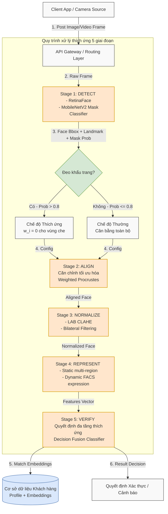

# Thiết Kế Chi Tiết Hệ Thống Backend Nhận Dạng Thích Ứng (face_recognition_be)

Tài liệu này mô tả chi tiết kiến trúc triển khai, sơ đồ luồng dữ liệu và thiết kế các khối chức năng của hệ thống Backend phục vụ cho đề tài **"Phân tích khách hàng dựa trên biểu cảm khuôn mặt"** (Customer Analysis based on Facial Expressions) áp dụng trong môi trường thẩm mỹ viện.

Thiết kế này hoàn toàn **độc lập với ngôn ngữ lập trình** và tập trung vào đặc tả logic, cấu trúc dữ liệu trao đổi (API Schemas) và quy trình xử lý thích ứng 5 giai đoạn.

---

## 1. Sơ đồ Kiến trúc Triển khai Chi tiết (Deployment & Flow Diagram)

Dưới đây là sơ đồ luồng xử lý và trao đổi thông tin giữa các thành phần từ khi nhận yêu cầu thu thập hình ảnh/video cho đến khi đưa ra quyết định xác thực và lưu trữ thông tin.



---

## 2. Đặc tả Chi tiết Quy trình 5 Giai đoạn

### Giai đoạn 1: Phát hiện (DETECT)
*   **Mục tiêu**: Định vị khuôn mặt và xác định các điểm mốc sơ bộ cùng với trạng thái đeo khẩu trang.
*   **Đầu vào**: Ảnh/khung hình thô từ Client (định dạng ảnh: RGB/BGR).
*   **Logic Xử lý**:
    1.  Chạy bộ dò **RetinaFace** để tìm bounding box và 5 điểm mốc (mắt trái, mắt phải, mũi, khóe miệng trái, khóe miệng phải).
    2.  Cắt vùng khuôn mặt (Crop) đưa qua bộ phân loại nhị phân **MobileNetV2** để dự đoán xác suất đeo khẩu trang ($P_{mask} \in [0, 1]$).
*   **Đầu ra**: 
    - Bounding Box: `[x, y, w, h]`
    - Tọa độ 5 mốc sơ bộ: `[(x1, y1), ..., (x5, y5)]`
    - Xác suất đeo khẩu trang: $P_{mask}$

### Giai đoạn 2: Căn chỉnh (ALIGN)
*   **Mục tiêu**: Xoay thẳng khuôn mặt về hướng chuẩn để giảm sai lệch góc chụp.
*   **Đầu vào**: Ảnh gốc, Bounding box, Mốc sơ bộ, Xác suất $P_{mask}$.
*   **Logic Xử lý**:
    -   **Trường hợp 1 (Chế độ Thường - $P_{mask} \le 0.8$)**: Sử dụng phép biến đổi Affine xoay dựa trên trục nối hai mắt.
    -   **Trường hợp 2 (Chế độ Thích ứng - $P_{mask} > 0.8$)**:
        1.  Trích xuất bản đồ điểm mốc mật độ cao (Dense Landmarks - 468 điểm).
        2.  Thiết lập mảng trọng số $W = [w_1, w_2, ..., w_{468}]$:
            *   Vùng bị khẩu trang che (mũi, miệng, cằm): $w_i = 0$
            *   Vùng mắt, trán, thái dương không bị che: $w_i = 1$
        3.  Tính toán ma trận xoay tối ưu dựa trên giải pháp **Weighted Procrustes Analysis** để giảm thiểu sai số bình phương có trọng số giữa tọa độ điểm mốc thực tế và mẫu chuẩn.
*   **Đầu ra**: Ảnh khuôn mặt đã được căn chỉnh và xoay thẳng đứng.

### Giai đoạn 3: Chuẩn hóa (NORMALIZE)
*   **Mục tiêu**: Loại bỏ bóng đổ do ánh sáng không đều và khử nhiễu từ các vết sưng, bầm tím tạm thời sau thẩm mỹ.
*   **Đầu vào**: Ảnh khuôn mặt đã căn chỉnh.
*   **Logic Xử lý**:
    1.  **Chuẩn hóa ánh sáng**: Chuyển ảnh sang không gian màu LAB $\rightarrow$ Áp dụng thuật toán **CLAHE** trên kênh L (Độ sáng) $\rightarrow$ Chuyển ngược lại RGB/BGR.
    2.  **Khử nhiễu cấu trúc da**: Sử dụng bộ lọc song phương (**Bilateral Filter**) để làm mịn da, xóa các vết sưng tấy đỏ hoặc bầm tím trong quá trình hồi phục mà vẫn giữ nguyên các đặc trưng cạnh sắc (ví dụ: viền mắt, sống mũi). Ở chế độ thích ứng, bộ lọc chỉ được áp dụng trên các vùng da thực được lộ ra.
*   **Đầu ra**: Ảnh khuôn mặt đã chuẩn hóa chất lượng cao.

### Giai đoạn 4: Biểu diễn đặc trưng (REPRESENT)
*   **Mục tiêu**: Trích xuất các biểu diễn vector đặc trưng tĩnh và hành vi động.
*   **Đầu vào**: Ảnh tĩnh đã chuẩn hóa và chuỗi khung hình video ngắn (nếu có).
*   **Logic Xử lý**:
    1.  **Trích xuất đặc trưng tĩnh đa phân vùng**: Cắt ảnh khuôn mặt thành 3 vùng:
        -   *Vùng thượng (Thượng mặt)*: Trán + Mắt.
        -   *Vùng trung (Trung mặt)*: Mũi + Gò má.
        -   *Vùng hạ (Hạ mặt)*: Miệng + Cằm.
        Trích xuất vector đặc trưng $E_{upper}, E_{middle}, E_{lower} \in \mathbb{R}^{512}$ cho từng phân vùng. Nếu ở chế độ thích ứng, các phân vùng bị che (trung và hạ mặt) sẽ không được tính toán.
    2.  **Trích xuất đặc trưng động (FACS)**: Phân tích chuỗi chuyển động cơ mặt của khách hàng qua thời gian (cười nhẹ, nháy mắt) để sinh ra vector đặc trưng hành vi $E_{dynamic} \in \mathbb{R}^{128}$.
*   **Đầu ra**: Tập hợp các vector đặc trưng ($E_{upper}, E_{middle}, E_{lower}, E_{dynamic}$).

### Giai đoạn 5: Xác thực thích ứng (VERIFY)
*   **Mục tiêu**: So sánh đặc trưng trích xuất với dữ liệu đăng ký gốc và đưa ra quyết định xác thực.
*   **Đầu vào**: Các vector đặc trưng hiện tại và các vector gốc lưu trong cơ sở dữ liệu.
*   **Logic Xử lý**:
    1.  Tính độ tương đồng Cosine cho từng thành phần tĩnh và động:
        $$S_{region} = \text{Cosine}(E_{region}^{(t)}, E_{region}^{(g)})$$
    2.  Phối hợp quyết định động dựa trên phân bổ trọng số thích ứng:
        $$Score = \alpha_1 S_{upper} + \alpha_2 S_{middle} + \alpha_3 S_{lower} + \beta S_{dynamic}$$
        *   *Khi đeo khẩu trang*: Hệ thống tự động cấu hình $\alpha_2 = 0, \alpha_3 = 0$ và tính toán lại $\alpha_1 + \beta = 1.0$.
    3.  Đối chiếu $Score$ với ngưỡng thích ứng $\theta_{adapt}$.
*   **Đầu ra**: Kết quả xác thực (`true` / `false`), điểm số chi tiết và lý do từ chối (nếu có).

---

## 3. Đặc tả Giao diện API logic (API Specifications)

Hệ thống Backend sẽ cung cấp các endpoint chính sau để Client tương tác (giao thức RESTful API / JSON):

### 3.1. Endpoint Đăng ký Khách hàng mới (`/api/v1/customers/register`)
*   **Method**: `POST`
*   **Request Body (Multipart Form-Data)**:
    -   `customer_id`: String (Mã khách hàng)
    -   `fullname`: String (Tên khách hàng)
    -   `reference_images`: List of Files (Ảnh đăng ký gốc - nhiều góc độ, không đeo khẩu trang)
    -   `reference_video`: File (Video 3 giây để học đặc trưng cơ mặt động)
*   **Response**:
    ```json
    {
      "status": "success",
      "message": "Customer registered successfully",
      "data": {
        "customer_id": "CUST_99182",
        "registered_at": "2026-06-26T15:21:00Z",
        "embeddings_created": {
          "static_regions": ["upper", "middle", "lower"],
          "dynamic_facs": true
        }
      }
    }
    ```

### 3.2. Endpoint Xác thực Khách hàng thích ứng (`/api/v1/customers/verify`)
*   **Method**: `POST`
*   **Request Body (Multipart Form-Data)**:
    -   `current_image`: File (Ảnh chụp trực tiếp từ camera check-in)
    -   `current_video`: File (Optional - Đoạn clip ngắn 3 giây ghi nhận chuyển động cơ mặt)
    -   `customer_id`: String (Mã định danh để so khớp 1-1)
*   **Response**:
    ```json
    {
      "status": "success",
      "data": {
        "verified": true,
        "matching_score": 0.785,
        "mask_detected": true,
        "mask_probability": 0.96,
        "applied_weights": {
          "alpha_1_upper": 0.70,
          "alpha_2_middle": 0.00,
          "alpha_3_lower": 0.00,
          "beta_dynamic": 0.30
        },
        "similarities": {
          "upper_face": 0.82,
          "middle_face": 0.00,
          "lower_face": 0.00,
          "dynamic_facs": 0.70
        }
      }
    }
    ```

---

## 4. Thiết kế Thực thể Dữ liệu (Database Schema Entities)

Để hỗ trợ việc so khớp và ghi nhận tiến trình thẩm mỹ, cơ sở dữ liệu cần lưu trữ các thực thể sau:

```
[Customer Profile]
  |-- customer_id (Primary Key)
  |-- fullname
  |-- created_at
  |-- treatment_history (Lịch sử trị liệu để hỗ trợ gán trọng số tự động)
        |-- date
        |-- treatment_type (e.g., "Botox trán", "Nâng mũi")
        |-- affected_regions (e.g., ["upper"], ["middle"])

[Facial Embeddings (Gallery)]
  |-- embedding_id
  |-- customer_id (Foreign Key)
  |-- is_active_reference (Boolean)
  |-- e_upper (Vector 512)
  |-- e_middle (Vector 512)
  |-- e_lower (Vector 512)
  |-- e_dynamic (Vector 128)
```
